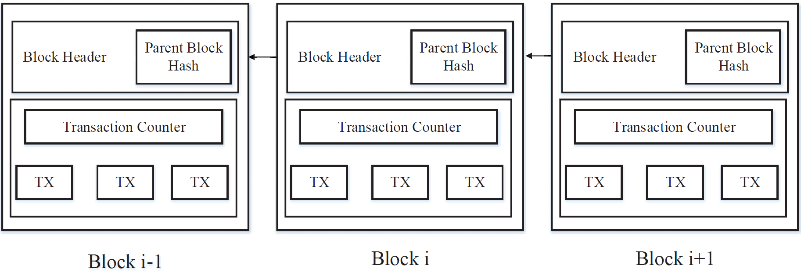
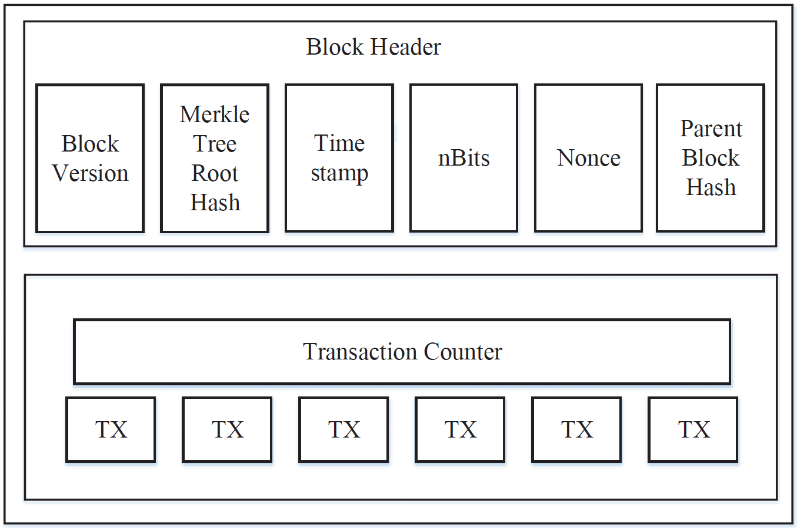
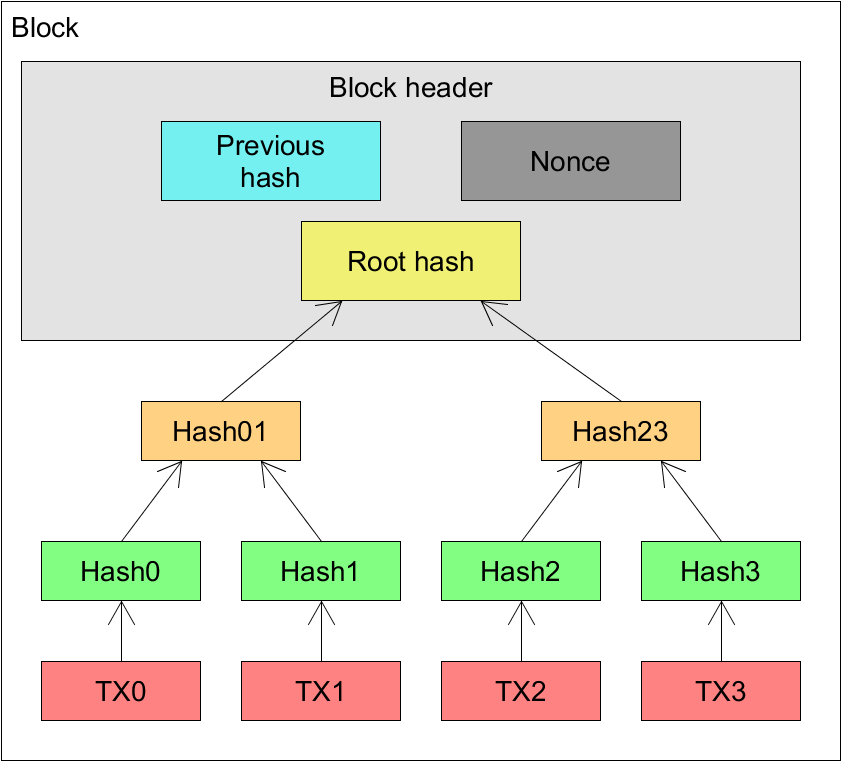

# Blockchain Technologie

## Architektur und Funktionsweise

Autor: Sebastian Janzen

## Arten einer Blockchain 

Autor: Sebastian Janzen

Public, Private, Konsortium, Permissionless, Permissioned etc.

## Eigenschaften einer Blockchain 

Autor: Björn Enders-Müller

### Immutable

### Transaktion

### Blöcke

Der Begriff Blockchain setzt sich aus den englischen Wörten „block“ und „chain“ zusammen. Dies übersetzt bedeutet so viel wie Blockkette, Kette aus Blöcken oder verkettete Blöcke. Dieser Abschnitt behandelt den Aufbau eines einzelnen Blockes der Blockchain.

In jeder Blockchain gibt es einen besonderen Block. Den sogenannten „genesis block“ oder auch Ursprungsblock. Er ist der erste und älteste Block der Blockchain. Als Ursprungsblock kann nur er alleine keinen sogenannten „parent block“, frei übersetzt Elternblock, haben. Jeder andere Block der Blockchain verweist jeweils auf den vorherigen Block. Die Blockchain ähnelt somit der Datenstruktur einer einfach verketteten Liste.

Die Aufgabe von Blöcken ist es Transaktionen innerhalb der Blockchain zu bündeln. Diese Blöcke werden dann mit unterschiedlichsten Verfahren auf alle Netzwerkknoten verteilt. Ein Block lässt sich in einen „block header“ und den „block body“ unterteilen. Der Block header enthält Metainformationen über den Block selbst, Elternblock und die Transaktionen. 

Abbildung entnommen aus <a>[[ZHENG17]](#ref_Zheng17)</a>

Abbildung entnommen aus <a>[[ZHENG17]](#ref_Zheng17)</a>

Wie in der Abbildung zu sehen ist besteht der Block aus unterschiedlichen Elementen. Der Header unterteilt sich in die folgenden sechs Teile:

* Block Version: Mit der Block version wird beschrieben mit welchen Regeln der Block validiert werden muss.
* Merkle Tree Root Hash: Enthält die Wurzel des „Merkel Tree“ oder auch sogenannten Hash-Baum. Der Baum enthält Hash-Werte zu jeder Transaktion des Blockes. Was genau eine Transaktion und ein Merkel Tree ist wird in anderen Abschnitten genauer erläutert. 
* Timestamp: Ein Timestamp ist ein Integer-Wert der jeder Sekunde seit dem 1. Januar 1970 UTC inkrementiert wird. 
* nBits: Der sogenannte nBits Wert ist ein Schwellwert um die Validität des Blocks zu überprüfen. Wenn der Hash-Wert des Blockes selbst größer ist als der nBits Wert ist der Block nicht zulässig. 
* Nonce: Die Nonce ist 4-Byte großes Datenfeld, welches in der Regel bei 0 startet und bei jedem Hash-Versuch inkrementiert wird. Miner verändern den Wert der Nonce und Hashen den Block danach erneut um zu überprüfen ob er in einem bestimmten Wertebereich liegt. Wenn dies nicht der Fall ist wird die Nonce erneut verändert und der Wertebereich wird erneut geprüft. Falls der Wert passt kann der Block verteilt werden und von anderen Netzwerkknoten überprüft werden und an die Blockchain gehängt werden.
* Parent Block Hash: Speichert den Hash-Wert des Elternblockes um eine einfach verkettete Liste von Blöcken zu erzeugen. Diese Mechanik sorgt für die Sicherheit vor Manipulation der älteren Blöcke.

Im body des Blocks befindet sich ein Zähler für die Anzahl der Transaktionen des Blockes. Zusätzlich lassen sich die Transaktionen selbst dort finden. Der genaue Aufbau einer Transaktion wird in anderen Abschnitten erläutert.

<a>[[ZHENG17]](#ref_Zheng17)</a>

### Merkle Tree

Ein Merkle tree ist eine Datenstruktur die auf einem Binär-Baum basiert. Bei einem Merkle tree wird jedoch in jeder Ebene eine One-Way-Hash-Funktion verwendet um den Baum und die Blätter vor Manipulation oder Fehlern zu schützen. Häufig wird daher der Merkle tree auch Hash-Baum genannt. Die Funktionsweise innerhalb einer Blockchain ist wie folgt. Jeder Block der Blockchain hält einen Hash-Baum oder zumindest die Wurzel des Baums, dazu im Folgenden mehr. Für eine Blockchain werden als Blätter die abzusichernden Transaktionen verwendet. Die Knoten direkt über den Transaktionen werden mit der Hash-Funktion erzeugt. In der darüberliegenden Ebene werden jeweils zwei Knoten zusammengeführt in dem für die Hash-Werte der beiden Knoten erneut ein dritter Hash-Wert erzeugt wird. Dieser Prozess wird fortgesetzt bis in der höchsten Ebene nur noch ein Knoten befindet. Die sogenannte Wurzel bzw. Root-Hash des Hash-Baums. In der folgenden Abbildung ist der Vorgang nochmal verdeutlicht.  

Abbildung entnommen und angepasst aus <a>[[Vujičić18]](#ref_Vujičić18)</a>

Zuerst wird für jede Transaktion (TX0 bis TX3) ein Hash-Wert (Hash0 bis Hash3) generiert. Anschließend wird für jeweils zwei benachbarte Hash-Werte (z.B. Hash0 und Hash1) noch ein dritter Hash-Wert (Hash01) gebildet. In der Abbildung wird so aus Hash0 und Hash1 der darüberliegende Knoten Hash01. Wenn der Block mehr als vier Transaktionen halten würde hätte der Hash-Baum mehr Ebenen als in der Abbildung. Im Block header wird die Wurzel des Baums gespeichert. In vielen Blockchain Systemen werden nach der Verifizierung des Blocks alle Knoten des Hash-Baums gelöscht um Speicherplatz einzusparen. Nur die Wurzel und die Transaktionen bleiben erhalten, da die Wurzel zum überprüfen ausreicht. Falls nachträglich jemand versucht z.B. die Transaktion TX0 zu manipulieren so würde dies bei einer Verifizierung auffallen, da sich der Hash-Wert der Transaktion verändert und somit auch der von dem Knoten Hash01. So propergiert der Fehler sich bis zur Wurzel und somit kann eine Manipulation erkannt werden. Theoretisch würde es reichen für alle Transaktionen nur einen Hash-Wert abzuspeichern, jedoch kann dann nicht nachvollzogen werden welche der Transaktionen manipuliert wurde. 

<a>[[Vujičić18]](#ref_Vujičić18)</a>

## Crypto-Economics

Autor: Kevin Schima

Tokenization
ICOs

## Herausforderungen und Risiken

### Technische Herausforderungen
Autor: Fynn Klöpper

Angriffsszenarios (Sybil attack, 51%-Attack)
Skalierung (-sprobleme)

### Ökonomische und gesellschaftliche Herausforderungen

Autoren: Mario Cichonczyk und Martin Teuber

Konsequenzen
Sozial-wissenschaftlich
betriebswirtschaftlich

## Literaturverzeichnis

<a name="ref_Zheng17">[ZHENG17]</a>: Zheng, Zibin ; Xie, Shaoan ; Dai, Hongning ; Chen, Xiangping ; Wang, Huaimin : An Overview of Blockchain Technology: Architecture, Consensus, and Future Trends. Honolulu, HI, USA : IEEE International Congress on Big Data, 2017, ISBN: 978-1-5386-1996-4

<a name="ref_Vujičić18">[Vujičić18]</a>: Vujičić, Dejan ; Jagodić, Dijana ; Ranđić, Siniša : Blockchain Technology, Bitcoin, and Ethereum: A Brief Overview. East Sarajevo, Bosnia and Herzegovina : IEEE INFOTEH-JAHORINA (INFOTEH), 17th International Symposium, 2018, ISBN: 978-1-5386-4907-7 

<a name="ref_Hofmann17">[Hofmann17]</a>: Hofmann, Frank ; Wurster, Simone ; Eyal, Ron ; Böhmecke-Schwafert, Moritz : The immutability concept of blockchains and benefits of early standardization. Nanjing, China : ITU Kaleidoscope: Challenges for a Data-Driven Society (ITU K), 2017, ISBN: 978-9-2612-4281-7 

