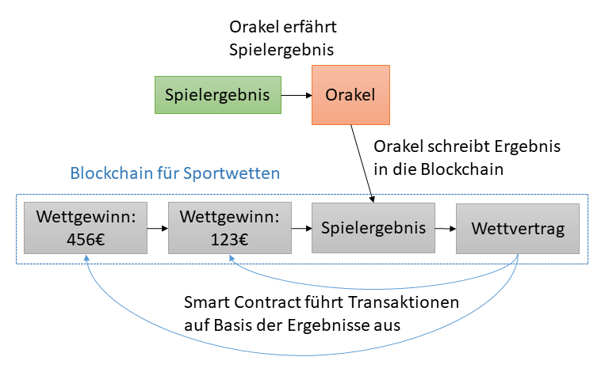

# Blockchain Use Cases

## Entscheidungsmodell 

Autor: Niklas Röhling

* Do you need a Blockchain? :  https://eprint.iacr.org/2017/375.pdf

## Smart Contracts

Der Begriff "Smart Contract" wurde erstmals 1996 von dem Computerwissenschaftler Nick Szabo verwendet, der ihn wie folgt definierte:

*"New institutions, and new ways to formalize the relationships that make up these institutions, are now made possible by the digital revolution. I call these new contracts "smart", because they are far more functional than their inanimate paper-based ancestors. No use of artificial intelligence is implied. A smart contract is a set of promises, specified in digital form, including protocols within which the parties perform on these promises."* [[SZAB96]](#ref_szab96)

Ein "Smart Contract" ist laut Szabo also die digitale Abbildung handelsüblicher Verträge, erweitert mit zusätzlichen Funktionalitäten für die Vertragsteilnehmer. So sollen beispielsweise kryptographische Protokolle und ähnliche Sicherheitsmaßnahmen bei der Überprüfung und Durchsetzung der Vertragsklauseln einen großen Vorteil bieten.

Das heutige Verständis eines "Smart Contract" begrenzt sich nicht auf das allgemeine Konzept eines Vertrags, sondern kann jede Form von Software sein. Durch aktuelle Implementierungen basierend auf einer Blockchain, werde außerdem nachvollziehbare und endgültige Transaktionen realisiert, sodass beim Erfüllen oder Brechen des Vertragen (oder Erreichen spezieller Konditionen) vorher festgelegte Aktionen eigenständig und automatisch ausgeführt werden. Durch solche Automatismen und dazugehörige Sicherheitsmaßnahmen wird eine dritte, unabhängige Partei, zur Überwachung von Transaktionen, überflüssig. [[GOLL17]](#ref_goll17)

Bei Implementierungen mittels Blockchain werden zu Beginn alle Vertragsbedingungen und damit zusammenhängende Aktionen definiert, in Quellcode geschrieben und in die Blockchain gehangen. Der fertige Vertrag beziehungsweise das fertige Programm wird auf die Knoten des Netzwerks kopiert und beim Eintreffer der festgelegten Bedingungen verifiziert und ausgeführt. Anzumerken ist, dass alle Vertragsteilnehmer den Vertrag  und dessen Bedingungen digital signieren und sich dadurch an diesen binden.

 Quelle: Eigene Darstellung

Vom Prinzip her können Smart Contracts nur auf die Informationen zugreifen, die in der dazugehörigen Blockchain hinterlegt sind. Die Verbindung zur echten Welt wird mittels konventionellen Anwendungen hergestellt, die auf externen Server laufen. Diese Anwendungen werden im Blockchain-Umfeld als "Orakel" bezeichnet und nehmen Einfluss auf die Blockchain, sobald spezielle Events eintreten. Die [Abbildung 1](#ref_smart_contract_oracel) verbildlicht die Funktion eines Orakels am Beispiel von Sportwetten. Dabei überwacht das Orakel die Ergebnisse von Spielen und schreibt diese in die Blockchain. Durch diese Informationen kann der Smart Contract die vorher definierten Aktionen ausführen und die Wetteinsätze passend verteilen. Beim Entwerfen von Smart Contracts und dazugehörige Orakel sollte die Sicherheit im Vordergrund stehen, da spätere Änderungen unmöglich sind. Sollte ein Orakel also falsche Informationen erhalten oder Situationen im Vertrag nicht bedacht worden sein, so kann dies unter Umständen fatale Folgen haben. [[CHAI17]](#ref_chai17)

Autor: Björn Böing

## Distributed Autonomous Organization (DAO)

- Eine Unternehmensform deren Organisation einzig durch Smart Contracts mit Blockchain gehandhabt wird und keine Mitarbeiter hat
- Investoren sollten je nach Anteil einen gewissen Anteil an Entscheidungen haben, die das Kapital betreffen
- Bekanntestes Beispiel ist die DAO von Ethereum
- https://bitcoinmagazine.com/articles/bootstrapping-a-decentralized-autonomous-corporation-part-i-1379644274/
- Raised 150,000,000$ in crowd funding
- Was meant to be a decentralized venture capital fund
- 50,000,000$ in ether tokens were siphoned off due to a bug in the smart contract code
- Eine Reihe von Schwachstellen (z.B. rekursive Aufrufe) wurden ausgenutzt, um die Token zu einem anderen Konto zu überweisen
- Wurde durch einen Hard-Fork wieder rückgängig gemacht und die Token konnte wiederhergestellt werden
- Mittlerweile nicht mehr als Unternehmen gelistet
- Risiken wurden mehrfach vorher angemerkt
- Die SEC ist zu dem Schluss gekommen, dass der Verkauf von Tokens als Sicherheit einer DAO unter das amerikanische Gesetz fällt https://www.sec.gov/news/press-release/2017-131

Autor: Björn Böing

## Legal tech 

Autor: Björn Böing

## Blockchain in Education

Autor: Matthias Kersting

## Blockchain und KI

* https://arxiv.org/abs/1802.04451

Autor: Matthias Kersting

## Literaturverzeichnis

<a name="ref_szab96">[SZAB96]</a>: Smart Contracts: Building Blocks for Digital Markets 1996 ; URL: <a>http://www.fon.hum.uva.nl/rob/Courses/InformationInSpeech/CDROM/Literature/LOTwinterschool2006/szabo.best.vwh.net/smart_contracts_2.html</a> (abgerufen am 05.03.2018)

<a name="ref_GOLL17">[GOLL17]</a>: Ethereum Wiki - White Paper 2017 ; URL: <a>https://github.com/ethereum/wiki/wiki/White-Paper/f18902f4e7fb21dc92b37e8a0963eec4b3f4793a</a> (abgerufen am 05.03.2018)

<a name="ref_CHAI17">[CHAI17]</a>: Chainfrog - What are smart contracts? 2017 ; URL: <a>http://www.chainfrog.com/wp-content/uploads/2017/08/smart-contracts.pdf</a> (abgerufen am 05.03.2018)