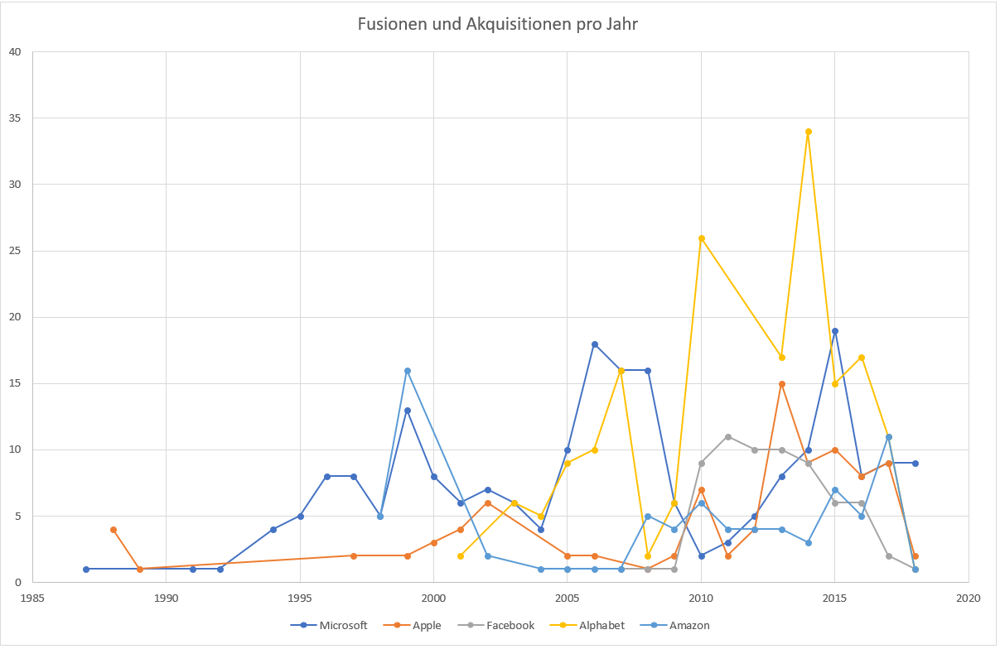
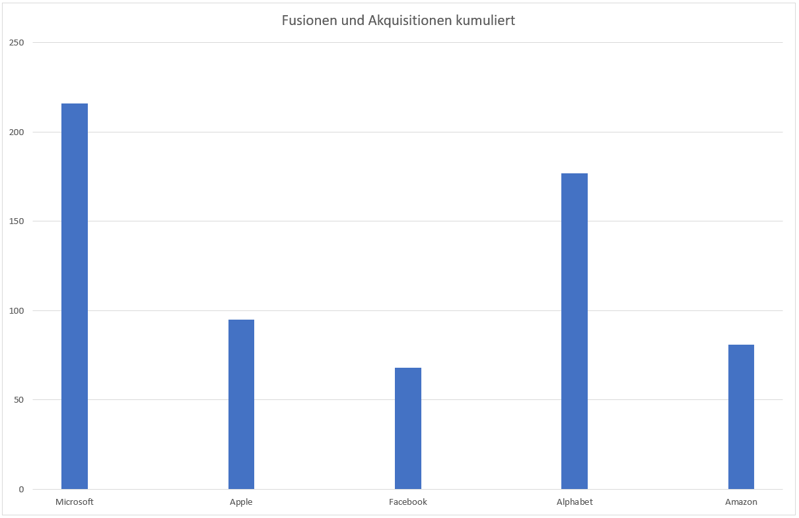
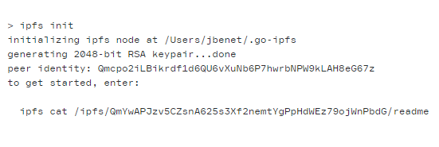
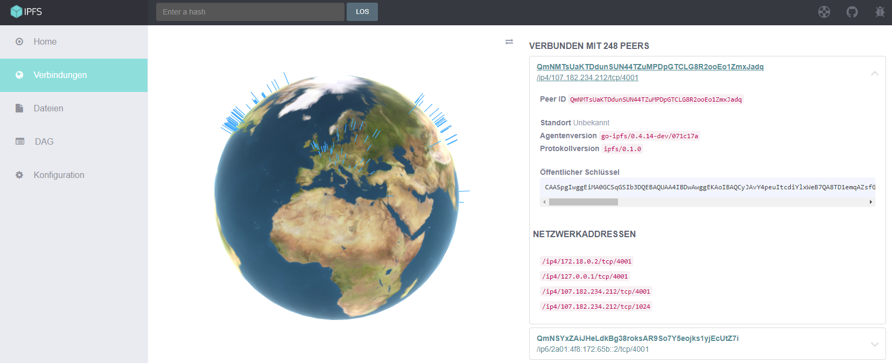
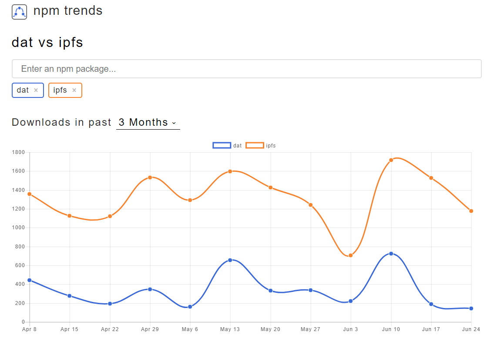

# Dezentrale Anwendungen

<!-- load css for math symbols -->
<link rel="stylesheet" href="https://cdnjs.cloudflare.com/ajax/libs/KaTeX/0.5.1/katex.min.css">
<link rel="stylesheet" href="https://cdn.jsdelivr.net/github-markdown-css/2.2.1/github-markdown.css"/>

*Autor: Patrick Lukas Starzynski*

## Allgemeines

### Das Internet
Das heutige Internet ging aus dem Computer-Netzwerk ARPANET hervor,
welches ursprünglich im Auftrag der US-Luftwaffe entwickelt wurde.
Zur Realisierung wurde eine teilvermaschte Netztopologie gewählt,
wie in der folgenden Abbildung zu sehen:


Abbildung entnommen aus [[WIKI18]](#ref_WIKI18)

Das dezentrale Netzwerk wurde geschaffen, um Institutionen,
 die im Auftrag des US-Verteidigungsministerium forschten, zu vernetzen. 
Das Ziel des Netzwerkes war es die Kommunikationskanäle im Falle 
eines Atomkriegs, für einen Vergeltungsschlag, aufrechterhalten zu können [[WHEE11]](#ref_WHEE11).

Diese grundsätzliche Idee der Dezentralisierung wurde vom heutigen Internet übernommen. 

So ist jedes Gerät, mit Zugang zum Internet, mit jedem anderen, dem Internet angeschlossenem, Gerät verbunden.
Exemplarisch gesprochen: Um vom Computer A zu C zu gelangen, gehe zunächst zu Computer B.
Wenn dieser nicht verfügbar ist, existiert ein Pfad von A nach D nach C.

### Zentralisierung des Internets

In der heutigen Zeit ist das Internet omnipräsent. Das IT-Beratungs- und Marktforschungsunternehmen Gartner Inc. hat im Februar 2017 einen Anstieg der 
sich Online befindlichen Geräte auf rund 8,4 Mrd. im Jahr 2017 prognostiziert [[GART17]](#ref_GART17). Somit befinden sich aller Voraussicht nach mehr Geräte im Internet als es Menschen auf der Erde gibt.

Jedoch ist in Frage zu stellen, ob die heutige Struktur des Internets tatsächlich ein dezentrales Netzwerk widerspiegelt. Welche Auswirkungen wären zu erwarten, wenn Unternehmen wie 
Alphabet Inc., Facebook oder Amazon.com ihre angebotenen Dienstleistungen einstellen würde? Oder wenn Internetangebote wie Wikipedia weltweit teilweise oder vollständig zensiert werden würden? 
Letzteres ist zumindest für viele der Internetnutzer tatsächlich Realität [[WIKI18f]](#ref_WIKI18f).

Um die Problematik dieser Fragestellung zu betrachten, ist ins Gedächtnis zu rufen, dass die konzeptionelle Idee eine Dezentralisierung der Kommunikation im Katastrophenfall war. 
Dennoch bedarf die Abschaltung und Kontrolle diverser Angebot des Internets keine Katastrophe, sondern ist kontrollierbar.
Ebenso werden Webhostingangebote oder Cloudlösungen häufig von den großen Internetdienstleistern angeboten, somit konzentriert sich der Datenverkehr an diversen zentralen Knotenpunkten. 
So hat beispielsweise das soziale Netzwerk Facebook im ersten Quartal 2018 monatlich rund 2,2 Mrd. aktive Nutzer zu verzeichnen [[STAT18a]](#ref_STAT18a).
Zusätzlich ist zu beobachten, dass  (u.a.) die genannten Unternehmen sich längst über ihre ursprüngliche Kernkompetenz hinaus entwickelt haben.
An dieser Stelle ist die Expansionsstrategie der Unternehmen Microsoft, Apple, Facebook, Alphabet und Amazon hervorzuheben. In den folgenden Abbildungen sind die Fusionen und Akquisitionen pro Jahr,
sowie die kumulierten Übernahmen dargestellt:



Eigene Grafik - Daten entnommen von [[WIKI18a]](#ref_WIKI18a) [[WIKI18b]](#ref_WIKI18b) [[WIKI18c]](#ref_WIKI18c) [[WIKI18d]](#ref_WIKI18d) [[WIKI18e]](#ref_WIKI18e) 



Eigene Grafik - Daten entnommen von [[WIKI18a]](#ref_WIKI18a) [[WIKI18b]](#ref_WIKI18b) [[WIKI18c]](#ref_WIKI18c) [[WIKI18d]](#ref_WIKI18d) [[WIKI18e]](#ref_WIKI18e)

Bedingt durch die Unternehmensgröße, dem Markteinfluss und der Expansionsstrategie ist eine Zentralisierung innerhalb des dezentralisierten Netzes festzustellen.
Dabei wird die Zensur durch Regierungen sogar noch ignoriert.

Dennoch ist hervorzuheben, dass die Angebote nicht per se negativ zu beurteilen sind,
 schließlich sind viele Angebote industriell als auch privat von wesentlicher Bedeutung. Dennoch hat sich mit dem Aufkommen des Bitcoins und anderer Kryptowährungen ein Bedürfnis 
 nach dezentralisierten Ansätzen entwickelt. Dabei steht oft die Kontrolle persönlicher Daten und Informationen im Vordergrund, sowie die Angst vor Zensurmechanismen oder dem Misstrauen gegenüber
 Institutionen wie Finanzdienstleistern oder Regierungen.
 
Auf Basis von Peer-to-Peer-Konzepten hat sich die Vision tatsächlicher Dezentralisierung entwickelt. Beflügelt durch die Kryptowährungen haben sich unter anderem die Protokolle IPFS und DAT entwickelt, welche in den folgenden Kapiteln erläutert werden.


Abbildung entnommen aus [[SHEA2017]](#ref_SHEA17)


## IPFS

### Konzept
Das interplanetare Fileystem, kurz IPFS, ist ein verteiltes Dateisystem, dass im 2015 erschienen ist. 
Konzeptionell ist es vergleichbar mit dem Peer-to-Peer-Protokoll BitTorrent.
Der wesentliche Unterschied zu klassischen Peer-to-Peer-Applikationen ist,
 dass IPFS für den Aufbau einer Netzinfrastruktur konzipiert wurde. 
 Dabei wurden die folgenden Herausforderungen,
 mit denen der aktuelle de facto Standard HTTP konfrontiert ist, identifiziert:
 <ol type="a">
  <li>Das Hosten und Verteilen von Datenmengen im Petabytebereich</li>
  <li>Die Verarbeitung von großen Datenmengen innerhalb einer Organisation</li>
  <li>On-Demand und/oder Echtzeitstreams</li>
  <li>Versionierung und Verlinkung von großen Datenmengen</li>
  <li>Dem versehentlichen Löschen von wichtigen Dokumenten</li>
</ol>

IPFS kombiniert Eigenschaften bekannter Systeme, wie z.B. DHTs, BitTorrent, Git und SFS [[BENE14]](#ref_BENE14).

#### Distributed Hash Tables

Verteilte Hashtabellen sind Datenstrukturen, die in Peer-to-Peer-Systemen genutzt werden, um die Speicherorte von Dateien abzubilden. 
So spiegelt jeder Speicherknoten einen Eintrag in der Hashtabelle wider. Diese vereinfachte Darstellung, dient als Vorlage für verschiedene Implementierungen und kann durch die generalisierte Schnittstelle
*publish(key, content)* und *lookup(key)* angeboten werden. Im IPFS-Kontext werden die Implementierungen Coral DSHT, Kademlia DHT bzw. S/Kademlia DHT genutzt [[BENE14]](#ref_BENE14).

##### Kademlia DHT

Einem Knoten wird ein 160-Bit Key zugeordnet, partizipierende Computer erhalten ebenso eine 160-Bit Knoten-ID, letztere ist einmalig und vergleichbar mit einer UUID. 
So werden Key-Value-Paare einer "nahen" ID zugeordnet. Zum Lokalisieren eines nahen Knotens wird ein Routingalgorithmus vom Start zum Ziel genutzt.
Kademlia betrachtet dabei Knoten als Blätter eines binären Baums, die Position eines Knoten wird anhand des kürzesten, einmaligen Präfix bspw. 0011 bestimmt.
Das genutzte Präfix wird durch eine XOR-Verknüpfung von zwei Knoten-IDs generiert [[MAYM02]](#ref_MAYM02).

Für IPFS hervorzuheben Eigenschaften sind [[BENE14]](#ref_BENE14):

1. Lookupfunktion in großen Netzwerken in $\mathcal{O}(\log_2 n)$

2. Geringer Overhead, optimierte Nachrichten zur Kontrolle im Netzwerk

3. Resistenz durch das Präferieren von langlebigen Knoten

4. Häufige Nutzung in bekannten P2P-Applikationen, wie z.B. in Gnutella oder BitTorrent,
 die ein Netzwerk von 20 Millionen Knoten bilden.

##### Coral DSHT

Coral ist eine Erweiterung des Kademlia Algorithmus, die die XOR-Verknüpfung zur Distanzermittlung verändert.
Resultierend werden Adressen der Peers, die Datenblöcke zur Verfügung stellen gespeichert. 
Außerdem wird die Funktion *get_value(key)* in *get_any_values(key)* geändert, um das Bilden von Hot-Spots zu minimieren.
Letztendlich werden in Abhängigkeit von Größe und Region, hierarchische Hashtabellen gebildet [[BENE14]](#ref_BENE14).

##### S/Kademlia DHT
Ist ebenfalls eine Erweiterung vom Kademlia Algorithmus, diese kennzeichnet sich zusätzliche Schutzmechanismen bzgl. Sybil-Attacken,
Knoten generieren PKI (Public-Key-Infrastruktur) Schlüsselpaare mit denen Nachrichten, die durch das Netzwerk propagiert werden zu signieren.
Der Lookupprozess wird über disjunkte Pfade durchgeführt, um gute Knoten miteinander zu verbinden [[BENE14]](#ref_BENE14).

#### BitTorrent

Ebenso wird IPFS durch drei Schlüsselfeatures des Filesharing Systems BitTorrent geprägt [[BENE14]](#ref_BENE14):

1. BitTorrent belohnt Knoten, die aktiv am Netzwerk teilnehmen und bestraft so genannte Leecher, die lediglich das Netzwerk belasten.
Als belastend zu verstehen sind Nutzer(-gruppen), die Dateien vom Netzwerk herunterladen und es vermeiden Dateien im Netzwerk zu verbreiten.

2. BitTorrent verwaltet seltene Datenchunks und versucht diese priorisiert zu verteilen.

3. Die Belohnungs- und Bestrafungsstrategie ist anfällig gegenüber einem Exploit, in dem Angreifer ihre Bandbreite auf weitere Peers aufteilen [[ADAM15]](#ref_ADAM15).

##### BitSwap Protocol

In IPFS wird das BitSwap-Protokoll genutzt, welches auf BitTorrent aufbaut. Dabei wird, umgangssprachlich gesprochen, ein Marktplatz realisiert. Jeder Peer signalisiert welche Blöcke er benötigt, als auch welche er anzubieten hat.
Dieses System ist ausreichend, wenn jeder Peer die Blöcke die der andere Peer benötigt zur Verfügung stellen kann. Wenn dies nicht der Fall ist, sinkt die eingehende Datenübertragunsrate des Peers, der weniger Blöcke zur Verfügung stellen kann.
Das System belohnt Peers, die seltene Blöcke zur Verfügung stellen, auch wenn diese nicht vom Peer selbst benötigt werden [[BENE14]](#ref_BENE14).

#### Git

Das Versionsverwaltungssystem Git, dass häufig mit der Website github.com assoziiert wird, bietet ebenso wichtige Funktionalitäten für das IPFS-Protokoll.
Als Randnotiz sei an dieser Stelle zu erwähnen, dass GitHub seit dem 04.06.2018 ebenfalls ein Bestandteil der Liste der Fusionen und Akquisitionen der Firma Microsoft geworden ist [[WIKI18c]](#ref_WIKI18c).
Für IPFS hervorzuheben sind die folgenden Funktionalitäten [[BENE14]](#ref_BENE14):

1. Unveränderbare Objekte die durch Dateien (blobs), Verzeichnisse (tree) und Veränderungen (commits) repräsentiert werden.

2. An den Inhalt gebundene Adressierung durch kryptografischen Hash der Inhalte.

3. Links zu Objekten bilden einen azyklischen gerichteten Graphen, bzw. Merkle DAG (siehe Buchkapitel Blockchain Technologien<a href="../blockchain/technologie/#merkle-tree"> Merkle Tree) </a>

4. Metadaten, die z.B. Branches, Tags etc. darstellen sind durch Zeigerreferenzen realisierbar, wodurch diese leicht zu erstellen und modifizieren sind.

5. Versionsänderungen modifizieren nur Referenzen oder fügen Objekte hinzu.

6. Verteilen von Versionsänderungen werden durch einen Objekttransfer und durch Modifizierung der Remotereferenz realisiert.

#### SFS

Zuletzt wird das Konzept von Self-Certified Filesystems genutzt, dass das Schema
<br/> **/sfs/`<Location>`:`<HostId>`** nutzt.
Die Location wird durch die Servernetzwerkadresse generiert während die **HostID = hash(public_key || Location)** definiert ist [[BENE14]](#ref_BENE14).

#### Architekturdesign

IPFS ist ein P2P-System, ohne privilegierte Knoten. Jeder Knoten speichert Dateien speichert Objekte in seinem lokalen Dateisystem.
Außerdem ist ein Knoten mit weiteren Knoten verbunden, mit denen Objekte ausgetauscht werden. 
Das Protokoll selbst ist in entsprechende Teilprotokolle, die jedoch nicht unabhängig voneinander sind, gegliedert [[BENE14]](#ref_BENE14):

1. **Identities** - Verwaltung der Generierung und Validierung der Knoten und deren Identitäten
2. **Network** - Verwaltung der Verbindung zwischen den Peers
3. **Routing** - Informationsverwaltung zur Lokalisation von Peers und Objekten (siehe DHT)
4. **Exchange** - Blockverteilungsprotokoll zum effizienten Austausch von Blöcken (siehe BitTorrent)
5. **Objects** - Merkle DAG der inhaltsgebundene, unveränderlichen Objekte und Links inkludiert
6. **Files** - Versionierung von Dateien, ähnlich der Git-Mechanik
7. **Naming** - Selbst-Zertifizierung des Filesystems (SFS)

#### Zusammenfassung

Zusammengefasst wurde IPFS konzipiert unter Berücksichtigung bekannter und bewährter Technologien.
Ziel vom interplanetaren Filesystem ist es eine Alternative zum aktuellem HTTP-Standard zu bieten.
So kann durch die Dezentralisierung eine Ersparnis der Bandbreitenkosten um bis zu 60% erzielt werden.
Die Kopplung einer Internetseite mit einem Hostinganbieter kann abgebildet werden, wodurch die Lebensspanne von Internetseite theoretisch unbegrenzt ist. 
Solange ein Peer im Netzwerk Dateien zur Verfügung stellt, ist eine gezielte Zensur unmöglich. Ebenso wird ein Dateiaustausch und das gemeinsame Bearbeiten von 
Objekten ermöglicht.

Zusammengefasst ist IPFS ein Protokoll, das die Verteilung von Inhalten verwaltet, diese Inhalte werden inhaltsgebunden adressiert. 
Es ist ein Dateisystem, dass aus Ordnern und Dateien besteht. Ebenso ist IPFS ein Netz, dass das Betrachten von Dokumenten, ähnlich HTTP, unterstützt. Auf Dateien kann ebenso mittels HTTP mit https://ipfs.io/`<path>` zugegriffen werden. 
Dabei garantieren Hashverfahren die Authentizität von Objekten, ermöglichen die Versionierung und Adressierung von Inhalten, ebenso werden Duplikate zuverlässig erkannt. Durch den modularen Aufbau sind Routingverfahren als auch die genutzten verteilten Hashtabellen individualisierbar.
Darüber hinaus ist IPFS ein P2P-System ohne einen "Central-Point-of-Failure" und vollständig dezentral, Dateien die lokal gespeichert werden sind weltweit abrufbar und nutzen die geteilte Bandbreite der Peers. Auch ist ein Nameservice gegeben, dieser verknüpft .onion, .bit etc. mit IPNS [[IPFS18]](#ref_IPFS18).


### Aktuelles

Aktuell ist jedoch das Ersetzen von HTTP ein weit entferntes Ziel, da sich IPFS aktuell (Stand 27.06.2018) im Zustand "Work in Progress" befindet.
Momentan existieren Implementierungen in Go und weniger weit entwickelt in JavaScript, Python und C, alle genannten Distributionen befinden sich in der Alpha-Entwicklungsphase [[IPFS18]](#ref_IPFS18).

> The IPFS protocol and its implementations are still in heavy development. This means that there may be problems in our protocols, or there may be mistakes in our implementations.
 And -- though IPFS is not production-ready yet -- many people are already running nodes in their machines. So we take security vulnerabilities very seriously.
 If you discover a security issue, please bring it to our attention right away! [[IPFS18]](#ref_IPFS18)
 
Trotz des frühen Entwicklungsstadiums ist das Arbeiten mit IPFS grundsätzlich möglich und es existieren bereits einige dezentrale Anwendungen in dem Kontext.
Insbesondere die Verschmelzung mit der Blockchaintechnologie bietet eine Kombinationsmöglichkeit mit IPFS, so bietet die Kryptowährung Filecoin eine Verschmelzung der Blockchain mit dem IPFS-Protokoll.
Diese Anwendung bietet einen Cloudservice an, bei denen Anbieter von Peers mit dem Filecoin entlohnt werden, während Nutzer diesen zur Verfügung gestellten Speicherplatz als Cloudspeicher nutzen können.
Auch existieren Spiegelungen der Wikipediaplattform in <a href="https://ipfs.io/ipfs/QmXoypizjW3WknFiJnKLwHCnL72vedxjQkDDP1mXWo6uco/wiki/"> Englisch </a>,
 <a href="https://ipfs.io/ipfs/QmWY4KZXKTuspGSwYVDNbNLLZcmSiQ63Mdmz7eRd4KzBbb"> Kurdisch </a> und <a href="https://ipfs.io/ipfs/QmT5NvUtoM5nWFfrQdVrFtvGfKFmG7AHE8P34isapyhCxX/wiki/Anasayfa.html"> Türkisch </a> im IPFS-Netzwerk,
 diese sind motiviert durch die Zensur der HTTP-Version von Wikipedia. Eine weitere interessante Funktion in dem Zusammenhang ist, dass eine Offlineversion von Inhalten abrufbar ist, da Inhalte vollständig heruntergeladen werden können.
 
### IPFS-CLI

#### Initialisierung
Die grundsätzliche Nutzung von IPFS als Peer erfordert die Installation des IPFS-Command-Line-Interfaces (<a href="https://dist.ipfs.io/#go-ipfs">hier</a>).
Nach der Installation ist im Kommandozeileinterfaces des Betriebssystems IPFS verfügbar. Um IPFS nutzen zu können, muss ein globales lokales Objektrepository angelegt werden. 
Dazu muss einmalig der Befehl `ipfs init` genutzt werden.  In der Standardkonfiguration wird ein .ipfs-Order im Home-Verzeichnis angelegt. 
Innerhalb des Verzeichnis befindet sich eine config-Datei im JSON-Format, diese dient zum Konfigurationen der IPFS-Repository, so beträgt z.B. die maximale des Storage 10-GB in der Standardkonfiguration. 



Abbildungen entnommen von [[PROT18]](#ref_PROT18)

Wie in der Abbildung zu sehen ist, wird nach der Initialisierung das Öffnen einer readme-Datei mit dem Befehl `ipfs cat /ipfs/<HASH>/readme` zum Starten angezeigt. 
Der Hash referenziert in diesem Beispiel ein Verzeichnis, während die readme eine Datei innerhalb des Verzeichnisses widerspiegelt. 
Folglich muss die Datei ebenfalls einen gültigen Hash besitzen, sonst wäre diese kein Teil vom IPFS-Netz.
So ermöglicht der Funktion `ipfs ls <HASH>` die Möglichkeit eine Auflistung der Dateien und ihrer Hashwerte innerhalb des Verzeichnisses. Jedoch ist zu berücksichtigen, dass nur eine Ausgabe erfolgt, wenn der Hash ein Verzeichnis und keine Datei referenziert.
Folglich ist die Ausgabe von `ipfs cat <HASH_DER_DATEI>` identisch zum Beispiel oben.

Die Ausgabe von `ipfs ls` spiegelt den Merkle DAG von IPFS wider, d.h. wenn eine Datei größer als die maximale Chunksize ist (256 kb), wird diese entsprechend im Merkle DAG dargestellt. 
So wird eine 512-KB Datei mit einem Hash repräsentiert und die jeweiligen Chunks als Knoten die dem Graphen des Objektes zugeordnet.


Abbildung entnommen von [[PROT18]](#ref_PROT18)

#### Daemon

Nach der Initialisierung wurde zwar ein Repository angelegt, jedoch ist dieser nicht mit dem IPFS-Netz verbunden. Zur Verbindung mit dem IPFS-Netz wird ein Daemon benötigt, welcher mit dem Befehl `ipfs daemon` erstellt werden kann.
Anschließend kann mit dem Befehl `ipfs swarm peers` eine Liste der verbundenen Peers, in der Form `<TRANSPORT_ADRESSE>/ipfs/<PUBLIC_KEY_HASH>` angezeigt werden. 
Nachdem Starten des Daemon, ist man in der Lage mit dem Netzwerk zu interagieren, in dem Objekte zur Verfügung gestellt und auch angefragt werden können.

#### Hinzufügen und Löschen von Objekten

Das Hinzufügen von Objekten erfolgt intuitiv mit den Befehlen `ipfs add <PATH>`. 

Zum Löschen muss berücksichtigt werden, dass IPFS einen Garbagecollector nutzt.
Der Garbagecollector löscht im vorgegebenen Intervall Objekte die nicht "gepinnt" wurden. Der `ipfs add`-Befehl führt ohne entsprechende Parameter intern den Befehl `ipfs pin add <PFAD>` aus, wodurch ein Objekten im lokalen Repository dauerhaft gespeichert wird.
Gepinnte Objekte werden nicht vom Garbagecollector entfernt sondern befinden sich, sofern der Daemon auf dem Peer aktiv ist, dauerhaft im IPFS-Netz. Um das Löschen von "ungepinnten" Objekten zu forcieren wird der Befehl `ipfs repo gc` genutzt.
Um das Pinnen der Objekte zu entfernen, muss `ipfs pin rm <HASH>` genutzt werden, anschließend wird der Garbagecollector beim nächsten Arbeitsintervall das Objekt entfernen. 
Zum Anzeigen der gepinnten Objekte wird `ipfs pin ls` genutzt.

Ein exemplarische Ablauf des beschriebenen Vorgangs:

```shell
C:\> ipfs pin ls
QmS4ustL54uo8FzR9455qaxZwuMiUhyvMcX9Ba8nUH4uVv recursive
QmXgqKTbzdh83pQtKFb19SpMCpDDcKR2ujqk3pKph9aCNF indirect
...

C:\> echo "ipfs text" | ipfs add -q
QmZEUJSwomVx3XQzwjHVPKiwmDtYcE1PbyoTf8wjAhTLwe

C:\> ipfs pin ls
QmZEUJSwomVx3XQzwjHVPKiwmDtYcE1PbyoTf8wjAhTLwe recursive
...

C:\> ipfs cat QmZEUJSwomVx3XQzwjHVPKiwmDtYcE1PbyoTf8wjAhTLwe
ipfs text

C:\> ipfc repo gc
...

C:\> ipfs cat QmZEUJSwomVx3XQzwjHVPKiwmDtYcE1PbyoTf8wjAhTLwe
ipfs text

C:\> ipfs pin rm QmZEUJSwomVx3XQzwjHVPKiwmDtYcE1PbyoTf8wjAhTLwe
unpinned QmZEUJSwomVx3XQzwjHVPKiwmDtYcE1PbyoTf8wjAhTLwe

C:\> ipfs repo gc
QmZEUJSwomVx3XQzwjHVPKiwmDtYcE1PbyoTf8wjAhTLwe
...

C:\> ipfs cat QmZEUJSwomVx3XQzwjHVPKiwmDtYcE1PbyoTf8wjAhTLwe
C:\>
```

#### IPFS-Gateway
Für die Interaktion mit IPFS mittels HTTP-Protokoll stehen entsprechende Gatewayserver zur Verfügung, diese sind in der Lage mit `<GATEWAY>/ipfs/<HASH>` hinzugefügte Inhalte über jeden Browser zur Verfügung zu stellen.
So ist die Wikipediaspiegelung im Browser über den Link `https://ipfs.io/ipfs/QmXoypizjW3WknFiJnKLwHCnL72vedxjQkDDP1mXWo6uco/wiki/` erreichbar, der Gateway ist in dem Fall ipfs.io. Jedoch kann das Abrufen eines IPFS-Objektes über einen Gateway beim erstmaligen Zugriff
mehrere Minuten dauern.

##### IPNS
Das Inter-Planetary-Naming-System, kurz IPNS, ermöglicht es die PeerID mit einem Hashwerte eines Objektes zu referenzieren. Dazu wird der Befehl `ipfs name publish <HASH>` genutzt. So kann mittels `<GATEWAY>/ip**n**s/<PEERID>` auf den assoziierten Inhalt zuzugreifen.
Jedoch ist der referenzierten Hash manuell anzupassen, dieser ändert sich aufgrund der unveränderlichen Datenstruktur nicht.


### WebUI

Die Web-UserInterface von IPFS kann, sofern der Daemon aktiv ist und die Standardportkonfiguration genutzt wird, mit der URL `localhost:5001/webui` im jedem Browser geladen werden.
Diese Applikation ist ein Beispiel für eine dezentrale Anwendung.
So kann in der Verbindungsrepubrik bspw. eine Liste der verbundenene Peers angezeigt werden, inkl. der PeerID, dem Standort (insofern ermittelbar).



Screenshot aus dem WebUI

Auch ist es möglich Objekte hinzuzufügen oder nach einem Hash zu suchen, ebenso ist das Herunterladen der assoziierte Dateien möglich. Das WebUI bietet eine Vielzahl der notwendigen Operationen für den Basisumgang mit IPFS und visualisiert diese anschaulich.
Darüber hinaus kann Einsicht in die Konfigurationen des eigenen Peers genommen werden, diese lassen sich ebenfalls modifizieren.


## DAT

### Konzept

Das DAT-Protokoll, ist Datensynchronisationsprotokoll, dass im Jahr 2013 erschienen ist.
So liegt der Fokus in der dezentralen Synchronization und Versionierung von Dateien und Ordnern.
Ähnlich wie beim IPFS-Protokoll, werden viele bekannte Technologien von existierenden Systemen genutzt [[OGDE18]](#ref_OGDE18):
1. Git 
2. BitTorrent
3. Kademlia Distributed Hash Tables
4. Peer to Peer Streaming Peer Protocol
5. WebTorrent

Die Ansätze der ersten drei Technologien/Systeme wurden bereits im [IPFS](#ipfs)-Kapitel erläutert und werden in diesem Kapitel nicht erneut beschrieben.


#### Peer to Peer Streaming Peer Protocol (PPSPP)

PPSPP definierten einen bestimmten Merkle Tree, der die Reihenfolge der angeforderten Daten festlegt.
Gegensätzliche wird beim BitTorrent-Protokoll keine Datentransferreihenfolge definiert, wodurch das Streamen nicht effizient realisiert werden kann. 
Obwohl PPSPP für das Videostreaming konzipiert wurde, eignet es sich ebenso für die Übertragung von Metadaten großer Dateien [[OGDE18]](#ref_OGDE18).


#### WebTorrent

Da BitTorrent UDP-Sockets nutzt, die in JavaScript nicht zur Verfügung stehen, ist keine direkten Nutzung im Browser möglich. Jedoch nutzt WebTorrent zur Datenübertragung WebRTC. 
Inkludiert sind das Protokoll zum Austauschen von Blöcken, ebenso das Trackerprotokoll um Peers zu klassifizieren. Die Implementierung wurde so realisiert, dass eine Kommunikation mit BitTorrent und WebTorrent möglich ist [[OGDE18]](#ref_OGDE18).

#### Datenintegrität

Die Gewährleistung der Datenintegrität ist eines der Schlüsselkritieren der dezentralisierten Systeme.
Es muss sichergestellt werden, dass die empfangene Daten exakt die angeforderten Daten sind.
Wenn beispielsweise ein HTTP-Hyperlink eine Datei referenziert, kann ein Nutzer oft nur durch erneutes Herunterladen herausfinden, ob es eine Änderung des Inhaltes gab. 
Dies ist zu begründen, dass im HTTP-Protokoll ein Hyperlink eine Adresse referenziert, im Gegensatz dazu wird in DAT (ebenso in IPFS) ein Hyperlink den Inhalt referenzieren. 
Um den Inhalt korrekt referenzieren zu können wir ein kryptografischer Hash, der die Datei eindeutig beschreibt, berechnet. Diese Hashes werden in einem Merkle Tree angeordnet (siehe [Git](#git)) [[OGDE18]](#ref_OGDE18).

#### DAT Links

Wie im obigen Abschnitt erläutert, werden zur Referenzierung von Daten Hashwerte genutzt. 
DAT-Links werden dabei durch einen 32-Byte-Public-Key dargestellt, so kann eine Nachrichten von jedem Peer mit dem Public-Key verifiziert werden. 
Der öffentliche Schlüssel wird vom Repositoryinhaber zur Verfügung gestellt und mit einem eigenen privaten Schlüssel generiert.
Da DAT über keine Authentifikationsmechanismen verfügt, kann der Dateizugriff nur die Verteilung öffentlicher Schlüssel reguliert werden [[OGDE18]](#ref_OGDE18).

#### Hypercore

Ist ein Modul von DAT das die Speicherung, die Datenintegrität und die Protokolle zur Netzwerknutzung implementiert. 
Aufbauend auf Hypercore ist das Dateisystem Hyperdrive, letzteres ist als Abstraktionsschicht um Daten des Dateisystems, dem Hauptanwendungsfall von DAT, zu repräsentieren. 
Beim Hinzufügen von Dateien wird eine Datei in Chunks unterteilt und in einem Merkle Tree angeordnet, dieser Baum kann anschließend für Versionskontrolle und dem Replikationsprozess genutzt werden.
Der Replikationsprozess wird ausgelöst, wenn mit weiteren Peers synchronisiert wird.
Dazu werden Hypercore Register genutzt, die eine binäre Datenstruktur, die ausschließlich erweitert werden kann und aus signierten kryptografischen Hashes besteht. Die Validierung erfolgt durch den Public-Key des Erstellers [[OGDE18]](#ref_OGDE18).

#### Zusammenfassung

Viele Komponenten vom DAT-Protokoll des DAT-Protokolls sind identisch mit IPFS. Jedoch erfolgt eine Unterscheidung im Anwendungsfall.
Während DAT auf die Versionierung von Dateien spezialisiert ist, liegt der Fokus beim IPFS eher auf der Verteilung von Dateien. 
Durch die Merkle Tree Struktur kann eine komplette Synchronisation vermieden werden, es müssen lediglich abweichende Komponenten (Deltas) zwischen den Peers ausgetauscht werden.
Diese Funktionalität ist im IPFS-System per se nicht gegeben, jedoch ist eine manuelle Implementierung ebenso möglich. 
Verglichen mit IPFS ist DAT ein spezialisiertes Protokoll, jedoch mit vielen parallelen Eigenschaften [[DATP18]](#ref_DATP18).

### Aktuelles

Während IPFS in vielen Teilaspekten noch technisch unausgereift (bezogen auf das Entwicklungsstadium), ist das DAT-Protokoll weiterentwickelt.



Abbildung generiert durch [[NPMT17]](#ref_NPMT17)

Wie in der Abbildung zu sehen ist die Entwicklung des IPFS-Protokolls und/oder aufbauender Anwendungen innerhalb der NPM-Community, gemessen an den Downloadzahlen, erfolgreicher. 
Dies kann ggf. durch die leichte Kombinationsmöglichkeit mit der Blockchaintechnologie oder dem breiten Anwendungsgebiet des IPFS-Protokolls begründet werden.


### DAT CLI

### Beakerbrowser

## DAT vs. IPFS vs. HTTP

## Literaturverzeichnis

<a name="ref_ADAM15">[ADAM15]</a>:
Adamsky, Florian et al., P2P File-Sharing in Hell: Exploiting BitTorrent Vulnerabilities to Launch
Distributed Reflective DoS Attacks, 2015

<a name="ref_BENE14">[BENE14]</a>:
Benet, Juan: IPFS - Content Addressed, Versioned, P2P File System, 2014

<a name="ref_DATP18">[DATP18]</a>
Dat Project, URL: https://datproject.org/ (abgerufen am 29.06.2018)

<a name="ref_GART17">[GART17]</a>:
Gartner, Inc., Gartner Says 8.4 Billion Connected "Things" Will Be in Use in 2017, Up 31 Percent From 2016, URL: https://www.gartner.com/newsroom/id/3598917 (abgerufen am 26.06.2018)

<a name="ref_IPFS18">[IPFS18]</a>:
Github-Repository IPFS, URL: https://github.com/ipfs/ipfs 2018 (abgerufen 27.06.2018)

<a name="ref_MAYM02">[MAYM02]</a>:
Maymounkov, Petar und Mazières, David, Kademlia: A Peer-to-peer information system based on the XOR Metric, 2002

<a name="ref_NPMT17">[NPMT17]</a>:
npm trends, URL: http://www.npmtrends.com/ 2017 (abgerufen am 30.06.2018)

<a name="ref_PROT18">[PROT18]</a>:
Protocol Labs, URL: https://ipfs.io/ (abgerufen am 26.06.2018)

<a name="ref_OGDE18">[OGDE18]</a>:
Ogden et al., Dat - Distributed Dataset Synchronization And Versioning, 2018

<a name="ref_SHEA17">[SHEA17]</a>: 
Shea, Ryan: Centralized vs Decentralized - The Internet of the Past, Present and Future, URL: https://medium.com/@ryanshea/the-internet-of-the-past-present-and-future-51b10c765d8d (abgerufen am 20.06.2018)

<a name="ref_STAT18">[STAT18]</a>:
Statista, Market capitalization of the largest internet companies worldwide as of May 2018 (in billion U.S. dollars), URL: https://www.statista.com/statistics/277483/market-value-of-the-largest-internet-companies-worldwide/ (abgerufen am 26.06.2018)

<a name="ref_STAT18a">[STAT18a]</a>:
Statista, Number of monthly active Facebook users worldwide as of 1st quarter 2018 (in millions), URL: https://www.statista.com/statistics/264810/number-of-monthly-active-facebook-users-worldwide/ (abgerufen am 26.06.2018)

<a name="ref_WHEE11">[WHEE11]</a>:
Wheen, Andrew: The birth of the Internet, Springer New York, 2011

<a name="ref_WIKI18">[WIKI18]</a>:
Wikipedia, Vermaschtes Netz. URL: https://de.wikipedia.org/wiki/Vermaschtes_Netz (abgerufen am 20.06.2018)

<a name="ref_WIKI18a">[WIKI18a]</a>:
Wikipedia, List of mergers and acquisitions by Facebook, URL: https://en.wikipedia.org/wiki/List_of_mergers_and_acquisitions_by_Facebook  (abgerufen am 26.06.2018)

<a name="ref_WIKI18b">[WIKI18b]</a>:
Wikipedia, List of mergers and acquisitions by Alphabet, URL: https://en.wikipedia.org/wiki/List_of_mergers_and_acquisitions_by_Alphabet (abgerufen am 26.06.2018)

<a name="ref_WIKI18c">[WIKI18c]</a>:
Wikipedia, List of mergers and acquisitions by Microsoft, URL: https://en.wikipedia.org/wiki/List_of_mergers_and_acquisitions_by_Microsoft (abgerufen am 26.06.2018)

<a name="ref_WIKI18d">[WIKI18d]</a>:
Wikipedia, List of mergers and acquisitions by Apple, URL: https://en.wikipedia.org/wiki/List_of_mergers_and_acquisitions_by_Apple (abgerufen am 26.06.2018)

<a name="ref_WIKI18e">[WIKI18e]</a>:
Wikipedia, List of mergers and acquisitions by Amazon, URL: https://en.wikipedia.org/wiki/List_of_mergers_and_acquisitions_by_Amazon (abgerufen am 26.06.2018)

<a name="ref_WIKI18f">[WIKI18f]</a>:
Wikipedia, Zensur von Wikipedia, URL: https://de.wikipedia.org/wiki/Zensur_von_Wikipedia (abgerufen am 26.06.2018)

