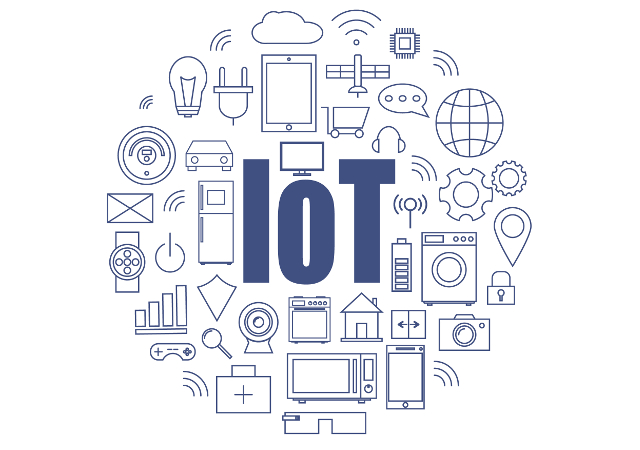
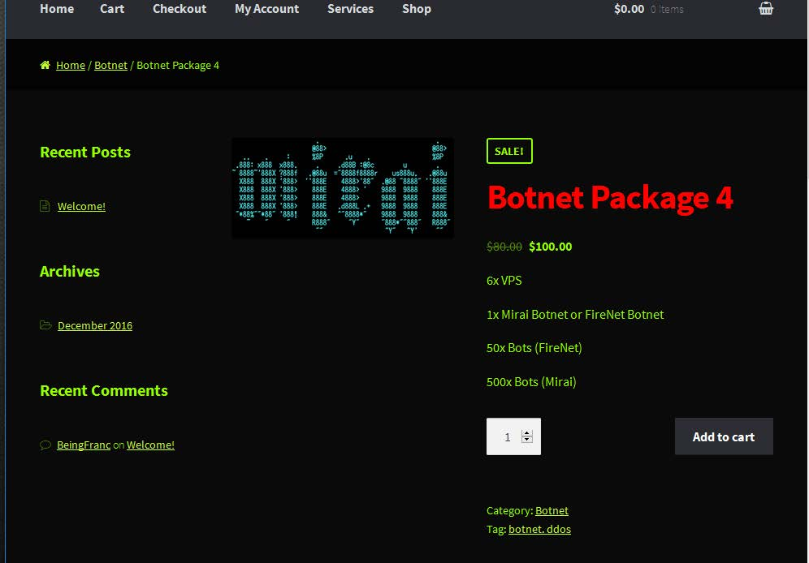
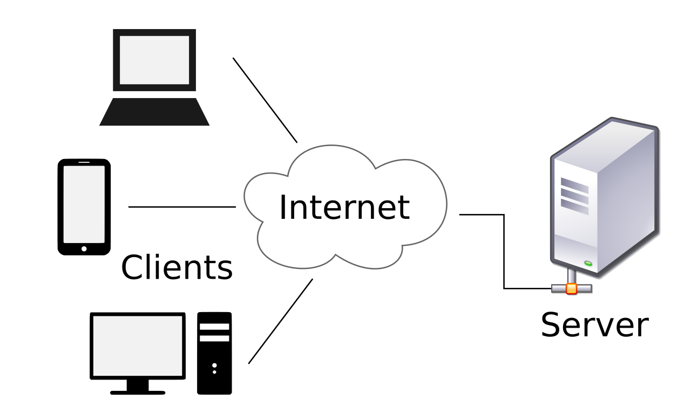
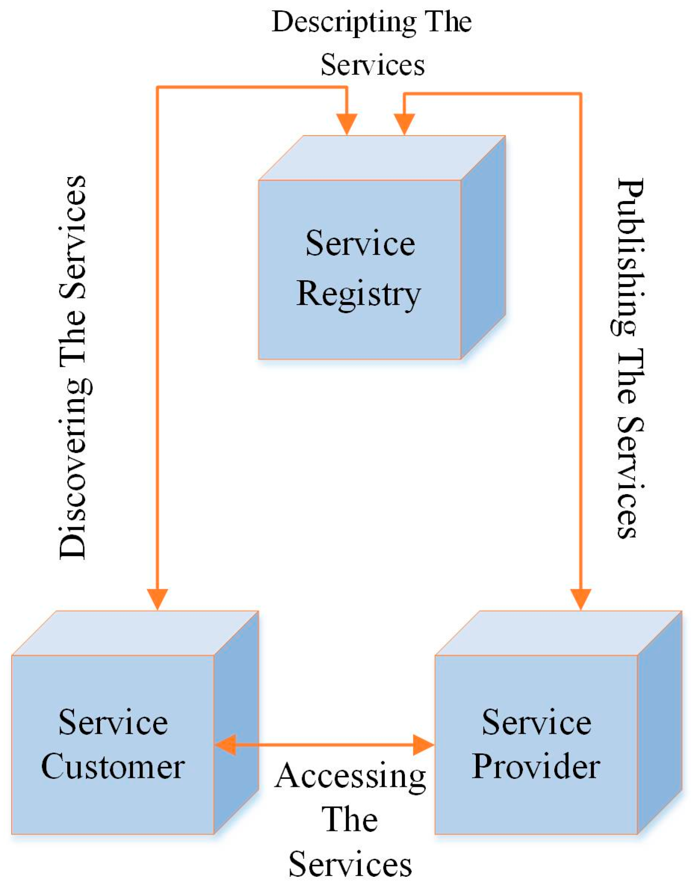

# Internet of Things

Autor: Lukas Stuckstette

[Präsentation und SW-Demo](https://github.com/lstuckstette/SGSE_IOT_DEMO)



[[VEC]](#VEC)

## Einleitung
Internet Of Things (IoT), zu Deutsch ‘Internet der Dinge’, beschreibt ein Netzwerk physikalischer Dinge wie Smart-Home-Geräte, Autos oder generell eingebettete Systeme. Das Netzwerk ermöglicht es diesen mit Sensoren und Akteuren ausgestatteten Dingen sich miteinander zu verbinden, zu kommunizieren und Daten auszutauschen.[[QUS18]](#QUS18)

Historisch gesehen basieren die Grundlagen des IoT auf verschiedenen Disziplinen wie zum Beispiel Echtzeit Analysen, maschinellem Lernen, Big Data, eingebetteten Systemen und vielen mehr[[ROU18]](#ROU18). Bereits 1982 wurde an der Carnegie Mellon University in den USA ein modifizierter Getränkeautomat entwickelt, welcher in der Lage war über das Internet den Füllstand und die Getränketemperatur mitzuteilen [[PAL14]](#PAL14). Der Begriff “Internet of Things” wurde wahrscheinlich erstmals 1999 in einer Präsentation des Unternehmens Procter & Gamble von Kevin Ashton genannt.[[ASH09]](#ASH09)

Der Markt für IoT Applikationen scheint auf absehbare Zeit deutlich zu wachsen - Laut dem Marktforschungsunternehmen Gartner stieg die Anzahl der vernetzten Geräte 2017 um 31% auf einen Stand von 8,4 Milliarden. Prognosen zufolge werden es 2020 bereits 20,4 Milliarden sein.
[[KÖH18]](#KÖH18)

Im Folgenden werfen wir einen genaueren Blick auf die Bereiche:
- IoT-Security
	- Umsetzungshinweise des BSI
	- IoT & Botnet
- IoT-Architektur
	- Event-Driven Architecture
	- Client-Server Architecture
	- Service-Oriented Architecture
- IoT-Protokolle
	- Infrastruktur
	- Identifikation
	- Transport
	- Discovery
	- Datenübertragung

## IoT-Security

### Umsetzungshinweise des BSI
Das Bundesamt für Sicherheit in der Informationstechnik (BSI) stellt einen Katalog unter [[BSI1]](#BSI1) zur Verfügung, in welchem umfangreiche Vorkehrungen und Schutzmaßnahmen erläutert werden, um eine sichere IoT-Applikation zu entwickeln.
Der Katalog definiert zunächst einen Entwicklungs-Lebenszyklus:

1. Planung und Konzeption
	- Definition des Einsatzes von IoT-Geräten innerhalb der Institution
	- Sorgfältige Planung und Dokumentation
2. Beschaffung
	- Auswahl geeigneter IoT-Geräte durch Kriterien: Update Funktionalität, Update-Prozess,  Authentisierungs Varianten sowie weitere organisatorische Randbedingungen
3. Umsetzung
	- Installation und Konfiguration nach Sicherheitsanforderungen
	- Prüfung von Einsatzumgebung und Stromversorgung
	- Zugriff auf IoT-Geräte regeln und absichern
4. Betrieb
	- Vor Inbetriebnahme Prüfung der Installations und Konfigurations Dokumentation
	- Protokollierung wichtiger und sicherheitsrelevanter Ereignisse
	- Überwachung des Netzverkehrs
5. Aussonderung
	- Sicherstellen, dass keine wichtigen oder sensiblen Daten auf IoT-Geräten zurückbleiben

Der Maßnahmenkatalog wird vom BSI in drei Bereiche geteilt: Basismaßnahmen, Standardmaßnahmen und Maßnahmen für erhöhten Schutzbedarf. Im folgenden werden einige konkrete Maßnahmen aus diesen Bereichen in chronologischer und zusammengefasster Form dargestellt:

1. Authentisierung
	- Authentisierung Pflichtkriterium bei Komponentenwahl
	- Bei Authentisierung über Passwort müssen sichere Passwörter verwendet werden -> Passwortrichtlinie
	- Voreingestellte Passwörter müssen geändert werden
	- Empfohlen: zertifikatsbasierte Authentisierung

2. Regelmäßige Aktualisierung
	- Während des Betriebs regelmäßiges Prüfen, ob Updates/Patches verfügbar sind
	- Zeitnahe Installation von Updates
	- Bei bekannten nicht behebbaren Schwachstellen Abschalten des Betriebs
	- Updates/Patches nur aus vertrauenswürdigen Quellen

3. Aktivieren von Auto-Update-Mechanismen
	- Autoupdates realisieren regelmäßige Aktualisierung
	- In kritischen Umgebungen oder bei hohem Anspruch an die IoT-Geräte hat manuelle Wartung Vorrang aufgrund möglicher unerwarteter Auswirkungen
	- Automatische Updates nur aus vertrauenswürdigen Quellen
	- Transportverschlüsselung (HTTPS) -> Man-in-the-Middle-Angriff

4. Einschränkung des Netzzugriffs
	- Firewall für zuvor definierte ein- und ausgehende Verbindungen
	- Ausgehende Verbindungen genau definieren
	- Eingehende Verbindungen nur mit Authentisierung
	- Keine netzwerkexternen Zugriffe auf das IoT-Gerät
	- Schließen von Port 23 (Telnet)
	- SSH (Port 22) nur mit hinreichend sicheren Passwörtern, besser zertifikatsbasierter Zugriff
	- Empfohlen: SSH über Zufallsport zwischen 10000-65535
	- Empfohlen: IoT-Geräte in gesondertem physikalischen Netzwerk oder Virtual Local Area Network (VLAN) laufen lassen

5. Aufnahme von IoT-Geräten in Sicherheitsrichtlinien
	- Anforderungen für IoT-Geräte konkretisieren
	- Eventuell mit IoT-Geräten verbundene übergeordnete Vorgaben wie IT-Richtlinie, Passwortrichtlinie etc. mit aufnehmen
	- Sicherheitsrichtlinie soll das generell zu erreichende Sicherheitsniveau spezifizieren

6. Planung des Einsatzes von IoT-Geräten
	- Grobkonzept sollte unter anderem basierend auf folgenden Aspekten erstellt werden: Welche Aufgaben soll das IoT-Gerät erfüllen? Welche Dienste werden genutzt? Anforderungen an Verfügbarkeit, Vertraulichkeit, Integrität?
	- Folgende Planung muss berücksichtigen: Athentisierung, Administration, Netzdienste und Netzanbindung, Protokollierung
	- Gesamten Prozess dokumentieren

7. Regelung des Einsatzes von IoT-Geräten
	- Benennung Verantwortlicher für Aktualisierungen, Wartungs- und Reparaturarbeiten, Protokollauswertung und Sicherheitsvorfälle
	- Regeln für Verhalten bei Ausfällen, Fehlfunktionen und Sicherheitsvorfällen definieren
	- Testverfahren für Sicherheit und Funktionsfähigkeit erstellen

8. Sichere Installation und Konfiguration
	- Installation und Konfiguration erfolgt nur durch autorisiertes Personal
	- Erstellen einer Checkliste für die Installation
	- Dokumentation der Installation
	- Grundeinstellungen auf Vorgaben der Sicherheitsrichtlinie überprüfen und anpassen

9. Verwendung sicherer Protokolle
	- Verwendung eines auf Verschlüsselung basierten Protokolls (SSL/TLS/SSH etc.)
	- Sichere Protokolle aktivieren und unsichere deaktivieren (z.B. telnet)
	- Sollten keine sicheren Protokolle unterstützt werden, so muss z.B. durch ein Virtual Private Network (VPN) Sicherheit gewährleistet werden
	- Alle nicht benötigten Protokolle deaktivieren

10. Restriktive Rechtevergabe
	- Restriktive Vergabe von Berechtigungen , so dass Benutzer nur auf Dienste zugreifen können, die sie für ihre Aufgaben benötigen

11. Überwachung des Netzverkehrs
	- Kommunikation regelmäßig auf Auffälligkeiten kontrollieren
	- Analyse von Firewall-Logfiles
	- Analyse von Netz-Statistiken mittels Netflow/Wireshark

12. Schutz der Administrations-Schnittstellen
	- Festhalten der zur Administration verwendeten Methoden in Sicherheitsrichtlinie
	- Sichere Protokolle verwenden

### IoT & Botnet
Ein klassisches Botnet ist eine Ansammlung von mit Malware infizierter Computer oder Server, oftmals als Zombi bezeichnet, welche es einem Angreifer ermöglichen den Computer/Server zu kontrollieren und Befehle auszuführen. Ein solches Botnet wird häufig dazu eingesetzt distributed-denial-of-service (DDoS) Angriffe auszuführen, Spam Mails zu versenden oder Identitätsdiebstahl zu begehen.

IoT Botnets ähneln klassischen Botnets dahingehend, dass ebenfalls IoT-Geräte mit Malware infiziert werden und anschließend vom Angreifer für Angriffe missbraucht werden können, jedoch liegt der Fokus bei IoT Botnets eher auf der Verbreitung der Malware und damit einhergehend eine Vergrößerung des Botnets. Während klassische Botnets oftmals eine Größenordnung von tausenden bis zehntausenden Computern/Servern infizieren, ist ein IoT Botnet in der Regel deutlich größer mit einer durchschnittlichen Anzahl von hunderttausenden infizierten Geräten.

Nicht nur durch den stetig wachsenden Markt an IoT-Geräten und Applikationen steigt das Interesse der Angreifer, auch durch oftmals vernachlässigte Sicherheitseinstellungen der IoT-Geräte sind IoT Botnets eine wachsende Bedrohung. Folgende Punkte zeigen einige Gründe, warum Angreifer IoT-Geräte bevorzugen:

- Leichte Beute, da IoT-Geräte oftmals mit Standardkennwörtern in Betrieb genommen werden und ihre Services öffentlich machen
- Always-On Geräte sind die Regel
- Viele Hersteller liefern Geräte mit mangelhaften Standardeinstellungen wie admin:password
- Malware kann simpel Kennwörter ändern um Nutzer und andere Angreifer auszusperren
- IoT-Geräte werden selten gewartet oder überwacht

Eines der bekanntesten IoT Botnets ist das 2016 entdeckte Botnet Mirai, welches für Rekord brechende DDoS Attacken auf die Plattformen von Krebs, OVH und Dyn verantwortlich war. Das Botnet griff hauptsächlich integrierte Fernsehkameras, Router und Videorecorder an und war in der Lage bis zu 1 Tbps an Traffic zu erzeugen. Im Darknet wurden anschließend Dienstleistungen des Mirai Botnet zum Verkauf angeboten.
[[RAD18]](#RAD18)


Mirai in AlphayBay, einem Darknet Marktplatz [[RAD16]](#RAD16)

## IoT-Architekturmuster
Im Folgenden werden typische IoT Software Architekturmuster erläutert.

### Event-Driven Architecture
Event-Driven Architecture (EDA) ist ein Architekturstil, in welchem Komponenten ereignisgesteuert agieren und die Interaktion durch Austausch von Ereignissen erfolgt.
Bei einer EDA liegt der Fokus der Softwarearchitektur auf Ereignissen. Ereignisse können dabei beliebigen Inhalt haben - sie können Aktivitäten, Vorgänge, Entscheidungen etc. abbilden. Ein Ereignis zeigt immer eine Veränderung eines Zustandes an und kann verschiedenen Abstraktionsebenen zugeordnet werden:

- Technische Ereignisse
	- z.B. Änderung eines Sensorwertes
- Systemereignisse
	- Technologie bezogen
	- z.B. eine HTTP-Request
- Geschäftsereignisse
	- Abbildung auf Geschäftslogik
	- z.B. Kündigung eines Vertrages

Die Kernfunktionalität einer Event-Driven Softwarearchitektur ist das ereignisgesteuerte Verarbeiten eintreffender Ereignisse aus internen oder externen Quellen. Wie die nachfolgende Abbildung verdeutlicht, wird dieser Prozess durch drei Grundschritte realisiert: Zunächst Erkennen von eintreffenden Ereignissen, Verarbeiten der Ereignisses und anschließendes Reagieren darauf.

[[BRU10]](#BRU10)

Abschließend folgt eine kleine Softwaredemonstration von EDA basiertem JavaScript Code:

```js
(() => {
  'use strict';

  class EventEmitter {
    constructor() {
      this.events = new Map();
    }

    on(event, listener) {
      if (typeof listener !== 'function') {
        throw new TypeError('The listener must be a function');
      }
      let listeners = this.events.get(event);
      if (!listeners) {
        listeners = new Set();
        this.events.set(event, listeners); 
      }
      listeners.add(listener);
      return this;
    }

    off(event, listener) {
      if (!arguments.length) {
        this.events.clear();
      } else if (arguments.length === 1) {
        this.events.delete(event);
      } else {
        const listeners = this.events.get(event);
        if (listeners) {
          listeners.delete(listener);
        }
      }
      return this;
    }

    emit(event, ...args) {
      const listeners = this.events.get(event);
      if (listeners) {
        for (let listener of listeners) {
          listener.apply(this, args);
        }
      }
      return this;
    }
  }

  this.EventEmitter = EventEmitter;
})();
```
Der oben gezeigte Code  demonstriert eine simple eventbasierte Klasse EventEmitter. Die Funktion “on” registriert ein Ereignis mit einer aufzurufenden Funktion, die Funktion “off” entfernt ein Ereignis, und die Funktion “emit” generiert ein Ereignis. Eine mögliche Nutzung der Klasse sähe daher so aus:

```js
const events = new EventEmitter();
events.on('foo', () => { console.log('foo'); });
events.emit('foo'); // Gibt "foo" aus
events.off('foo');
events.emit('foo'); // Nichts passiert
```
### Client-Server Architecture
Die Client-Server Architecture ist eine weit verbreitete Softwarearchitektur für verteilte Systeme. Ein oder mehrere Clients senden Anfragen an einen Server, welcher diese Verarbeitet und eine generierte Antwort zurück an den Client schickt. Ein typisches Beispiel für eine solche Architektur ist der Aufruf einer Webseite, wobei der Browser als Client und der HTTP(S)-Webserver als Server fungiert.
[[OLU14]](#OLU14)


Client-Server Architecture [[VIG11]](#VIG11)

JavaScript Beispielcode eines HTTP-Webservers, abrufbar über einen Browser:

```js
var http = require('http');

http.createServer(function (req, res) {
  res.write('Hello World!'); //Antwort an Client senden
  res.end(); //Antwort beenden
}).listen(80); //Der Server läuft auf Port 80

```
Auf eine HTTP-GET Anfrage antwortet der Server mit "Hello World!".

### Service-Oriented Architecture
Service-Oriented Architecture (SOA) beschreibt eine Softwarearchitektur aus verschiedenen entkoppelten Services, welche eine definierte Schnittstelle besitzen und kombiniert werden können um eine Applikation abzubilden. Die Services sind aufgrund ihrer universellen Schnittstelle plattformunabhängig.
[[PER03]](#PER03)


Service-Oriented Architecture [[ALS17]](#ALS17)

Die obige Abbildung zeigt die typischen Komponenten einer SOA: Ein “Service Provider” stellt die zur Verfügung stehenden Services bereit und registriert diese bei der “Service Registry”. Falls nun ein “Service Customer” einen spezifischen Service nutzen will, so fragt dieser die “Service Registry” nach dem gewünschten Service und erhält, sofern  der Service registriert wurde, eine eindeutige Identifikation des Services, woraufhin sich der “Service Customer” direkt mit dem Service verbinden und ihn nutzen kann.

## IoT-Protokolle
Im Folgenden werden einige typische Protokolle und Technologien des Internet of Things erläutert. Anstatt diese Protokolle auf klassische hierarchische Modelle wie das OSI-Modell abzubilden, werden folgend 5 Schichten einer typischen IoT-Applikation dargestellt und jeweils einige gängige Protokolle / Technologien gegebenenfalls mit Beispielen erläutert.
[[POS18]](#POS18)

### Infrastruktur

#### IPv4/IPv6
IPv4 und sein Nachfolger IPv6 sind Internet Layer Protokolle zur Datenübertragung in paketvermittelnden Netzwerken. Zu sendende Daten werden mit Header-Daten versehen und in Paketen verschickt. Im Gegensatz zu IPv4 werden Adressen in IPv6 mit 128-bit adressiert, wodurch erheblich mehr IP-Adressen vergeben werden können im Vergleich zu 32-bit bei IPv4. Es wurden einige weitere Protokolle entwickelt, wie QUIC (Google), NanoIP uvm., jedoch werden diese extrem selten eingesetzt im Vergleich zu IPv4/IPv6.
[[DEE17]](#DEE17)

### Identifikation

#### URI
Uniform Resource Identifier (URI) bezeichnet eine Zeichenfolge, die zur Identifizierung einer physikalischen oder abstrakten Ressource genutzt werden kann. URIs werden meistens zur Bezeichnung von Ressources Im Internet (Webseiten, Dateien, Services, Mailadressen etc.) eingesetzt. Der aktuelle Standard wird unter [[BER05]](#BER05) spezifiziert.
Die Syntax eines URI ist wie folgt aufgebaut:
```
URI = scheme:[//authority]path[?query][#fragment]
```
Ein Beispiel:
```
https://john.doe@www.example.com:123/forum/questions/?tag=networking&order=newest#top
```

#### ucode
“ucode” ist ein zahlenbasiertes Identifikationssystem für physikalische Objekte. Das System nutzt einen 128-bit code um eindeutige Identifikatoren zu erstellen. “ucode” wird von der in Tokyo Japan ansässigen non-profit Organisation “uID center” verwaltet. Eine Abfrage eines ucodes funktioniert ähnlich wie ein DNS-lookups und muss von einem zentral verwalteten Server des “uID centers” erfolgen.
[[UID09]](#UID09)

### Transport
Ähnlich konventioneller verteilter Systeme erfolgt der Transport der Datenpakete über die üblichen Wege wie Ethernet, WiFi, Bluetooth oder NFC, mit der Erweiterung von Mobilfunk.

### Discovery

#### mDNS
“multicast Domain Name Service” (mDNS) dient dazu in kleinen Netzwerken Namen in IP-Adressen zu übersetzen, ohne dabei einen DNS-Server zu benötigen - ist jedoch mit normalen DNS basierten Netzwerken kompatibel.  mDNS wurde 2013 von Stuart Cheshire veröffentlicht.
[[CHE13]](#CHE13)

#### HyperCat
HyperCat ist ein JSON basiertes Protokoll um Kataloge von URIs zu veröffentlichen. Dazu sollte ein Server unter einer bekannten Adresse,  z.B. 'http://hub.com/cat', ein JSON Objekt zur Verfügung stellen, in welchem alle erreichbaren Ressourcen inklusive MIME-Types aufgelistet sind.
[[HYP]](#HYP)

### Datenübertragung

#### MQTT
Das “Message Queuing Telemetry Transport” (MQTT) Protokoll ermöglicht einen publish/subscribe basierten Nachrichtenaustausch, welcher auf TCP/IP basiert. Zur Nachrichtenübermittlung ist ein message broker notwendig. Die erste Version von MQTT wurde 1999 von Andy Stanford-Clark (IBM) veröffentlicht.  Die aktuelle Version 3.1.1 wurde im Dezember 2014 veröffentlicht und ein Standard bei der Organisation OASIS eingereicht.
[[OAS14]](#OAS14)

JavaScript Code Beispiel:

```js
var mqtt = require('mqtt')
var client  = mqtt.connect('mqtt://test.mosquitto.org')

client.on('connect', function () {
  client.subscribe('presence')
  client.publish('presence', 'Hello mqtt')
})

client.on('message', function (topic, message) {
  // message is Buffer
  console.log(message.toString())
  client.end()
})

```
Der obige Code zeigt die Verbindung mit dem dedizierten MQTT Broker “mqtt://test.mosquitto.org”, anschließend einen 
"subscribe" und direkt zu Demonstrationszwecken einen "publish" in der client.on(‘connect’,...) Funktion. Die listener Funktion client.on(‘message’,...) wird automatisch aufgerufen und gibt ‘Hello mqtt’ auf der Konsole aus.

#### REST
Representational State Transfer (REST) bietet eine zustandslose Schnittstelle für verteilte Systeme, insbesondere Webservices. REST basiert auf den CRUD-HTTP Operationen GET, PUT, POST, DELETE, UPDATE und ermöglicht Zugriff auf Ressourcen durch definierte URIs. Roy Fielding definierte REST erstmals im Jahr 2000 durch seine Doktorarbeit “Architectural Styles and the Design of Network-based Software Architectures” an der UC Irvine.
[[BOO14]](#BOO14)

JavaScript Code Beispiel:

```js
var express = require('express');
var app = express();

app.get('/helloWorld', function (req, res) {
   res.end(‘Hello World!’);
})

var server = app.listen(8081);
```
Der obige Code zeigt einen simplen REST Webservice, welcher bei einem GET-Request auf die URI “/helloWorld” “Hello World!” zurückgibt.

#### WebSocket
WebSocket definiert ein bidirektionales Kommunikationsprotokoll über eine TCP Verbindung. Das Haupteinsatzgebiet von WebSockets liegt in Kommunikation von Webanwendungen mit einem WebSocket-Server. Das Protokoll wurde 2011 von Ian Fette (Google) bei der IETF veröffentlicht.
[[FET11]](#FET11)

JavaScript Code Beispiel:

Server:
```js
var WebSocketServer = require('ws').Server,
  wss = new WebSocketServer({port: 40510})

wss.on('connection', function (ws) {
  ws.on('message', function (message) {
    console.log('received: %s', message)
  })

  setInterval(
    () => ws.send(`${new Date()}`),
    1000
  )
})
```

Client:
```js
var ws = new WebSocket('ws://localhost:40510');

    // event emmited when connected
    ws.onopen = function () {
        console.log('websocket is connected ...')

        // sending a send event to websocket server
        ws.send('connected')
    }

    // event emmited when receiving message 
    ws.onmessage = function (ev) {
        console.log(ev);
    }
```
Der obige Code zeigt eine Kommunikation zwischen Server und Client: Der Client sendet in der ws.onopen Funktion die Nachricht “connected” an den definierten Server, woraufhin dieser sekündlich die aktuelle Uhrzeit an den Clienten schickt.

## Literaturverzeichnis

<table style="width:100%">
    <tr>
        <td rowspan="2" style="width:10%"><a name="QUS18">[QUS18]</a></td>
        <td style="width:90%">qusay f., Hassan; Wiley-IEEE, Jun. 2018; Internet of Things A to Z: Technologies and Applications</td>
    </tr>
    <tr>
        <td>URL: <a> https://www.researchgate.net/publication/322538736</a> (abgerufen am 28.06.2018)</td>
    </tr>
	<tr>
        <td rowspan="2" style="width:10%"><a name="KÖH18">[KÖH18]</a></td>
        <td style="width:90%">Köhn, Rüdiger; FAZ, 16.02.2018; Konzerne verbünden sich gegen Hacker</td>
    </tr>
    <tr>
        <td>URL: <a>http://www.faz.net/-ikh-976sx</a> (abgerufen am  29.06.18)</td>
    </tr>
	<tr>
        <td rowspan="2" style="width:10%"><a name="ROU18">[ROU18]</a></td>
        <td style="width:90%">Rouse, Margaret; IoT Agenda, Jun. 2018; Definition: 
internet of things (IoT)</td>
    </tr>
    <tr>
        <td>URL: <a>https://internetofthingsagenda.techtarget.com/definition/Internet-of-Things-IoT</a> (abgerufen am  29.06.18)</td>
    </tr>
	<tr>
        <td rowspan="2" style="width:10%"><a name="PAL14">[PAL14]</a></td>
        <td style="width:90%">Palermo, Frank; InformationWeek, Jul. 2014; Internet of Things Done Wrong Stifles Innovation</td>
    </tr>
    <tr>
        <td>URL: <a>https://www.informationweek.com/strategic-cio/executive-insights-and-innovation/internet-of-things-done-wrong-stifles-innovation/a/d-id/1279157</a> (abgerufen am  28.06.18)</td>
    </tr>
	<tr>
        <td rowspan="2" style="width:10%"><a name="ASH09">[ASH09]</a></td>
        <td style="width:90%">Ashton, Kevin; RFID Journal, Jun. 2009; That 'Internet of Things' Thing</td>
    </tr>
    <tr>
        <td>URL: <a>http://www.rfidjournal.com/articles/view?4986</a> (abgerufen am  27.06.18)</td>
    </tr>
	<tr>
        <td rowspan="2" style="width:10%"><a name="VEC">[VEC]</a></td>
        <td style="width:90%">Vectimus;Shutterstock;Internet of things and smart home illustration. </td>
    </tr>
    <tr>
        <td>URL: <a>https://www.shutterstock.com/image-vector/513856630</a> (abgerufen am  22.06.18)</td>
    </tr>
	<tr>
        <td rowspan="2" style="width:10%"><a name="BRU10">[BRU10]</a></td>
        <td style="width:90%">Bruns, Dunkel; Springer, 2010; Event-Driven Architecture</td>
    </tr>
    <tr>
        <td>URL: <a>https://link.springer.com/book/10.1007/978-3-642-02439-9</a> (abgerufen am  18.06.18)</td>
    </tr>
	<tr>
        <td rowspan="2" style="width:10%"><a name="BSI1">[BSI1]</a></td>
        <td style="width:90%">BSI, Bundesamt für Sicherheit in der Informationstechnik; Umsetzungshinweise zum Baustein SYS.4.4 Allgemeines IoT-Gerät</td>
    </tr>
    <tr>
        <td>URL: <a>https://www.bsi.bund.de/DE/Themen/ITGrundschutz/ITGrundschutzKompendium/umsetzungshinweise/SYS/Umsetzungshinweise_zum_Baustein_SYS_4_4_Allgemeines_IoT-Ger%C3%A4t.html</a> (abgerufen am  22.06.18)</td>
    </tr>
	<tr>
        <td rowspan="2" style="width:10%"><a name="RAD18">[RAD18]</a></td>
        <td style="width:90%">Radware;radware Blog, März 2018; A Quick History of IoT Botnets</td>
    </tr>
    <tr>
        <td>URL: <a>https://blog.radware.com/uncategorized/2018/03/history-of-iot-botnets/</a> (abgerufen am  28.06.18)</td>
    </tr>
	<tr>
        <td rowspan="2" style="width:10%"><a name="RAD16">[RAD16]</a></td>
        <td style="width:90%">Radware;radware Blog, Dezember 2016;The Rapid Evolution of Mirai Botnet DDoS Attacks</td>
    </tr>
    <tr>
        <td>URL: <a>https://security.radware.com/ddos-threats-attacks/threat-advisories-attack-reports/mirai-rapid-evolution/</a> (abgerufen am  28.06.18)</td>
    </tr>
	<tr>
        <td rowspan="2" style="width:10%"><a name="VIG11">[VIG11]</a></td>
        <td style="width:90%">Vignoni, David; Wikimedia, Juli 2011; Client-Server Model</td>
    </tr>
    <tr>
        <td>URL: <a> https://commons.wikimedia.org/wiki/File:Client-server-model.svg</a> (abgerufen am  30.06.18)</td>
    </tr>
	<tr>
        <td rowspan="2" style="width:10%"><a name="OLU14">[OLU14]</a></td>
        <td style="width:90%">Oluwatosin, Haroon Shakirat; IOSR Journal of Computer Engineering, Februar 2014; Client-Server Model</td>
    </tr>
    <tr>
        <td>URL: <a>https://pdfs.semanticscholar.org/e1d2/133541a5d22d0ee60ee39a0fece970a4ddbf.pdf</a> (abgerufen am  22.06.18)</td>
    </tr>
	<tr>
        <td rowspan="2" style="width:10%"><a name="PER03">[PER03]</a></td>
        <td style="width:90%">Perrey, Lycett; IEEE, Juli 2003; Service-oriented architecture</td>
    </tr>
    <tr>
        <td>URL: <a>https://ieeexplore.ieee.org/abstract/document/1210138/</a> (abgerufen am  25.06.18)</td>
    </tr>
	<tr>
        <td rowspan="2" style="width:10%"><a name="ALS17">[ALS17]</a></td>
        <td style="width:90%">Alshinina, R.; Elleithy, K.; März 2017; Performance and Challenges of Service-Oriented Architecture for Wireless Sensor Networks</td>
    </tr>
    <tr>
        <td>URL: <a>http://www.mdpi.com/1424-8220/17/3/536</a> (abgerufen am  25.06.18)</td>
    </tr>
	<tr>
        <td rowspan="2" style="width:10%"><a name="POS18">[POS18]</a></td>
        <td style="width:90%">Postscapes, Juni 2018; IoT Standards and Protocols</td>
    </tr>
    <tr>
        <td>URL: <a>https://www.postscapes.com/internet-of-things-protocols/</a> (abgerufen am  29.06.18)</td>
    </tr>
	<tr>
        <td rowspan="2" style="width:10%"><a name="BER05">[BER05]</a></td>
        <td style="width:90%">Berners-Lee, T.; W3C/MIT, Januar 2005; Uniform Resource Identifier (URI): Generic Syntax</td>
    </tr>
    <tr>
        <td>URL: <a>https://tools.ietf.org/html/rfc3986</a> (abgerufen am  22.06.18)</td>
    </tr>
	<tr>
        <td rowspan="2" style="width:10%"><a name="UID09">[UID09]</a></td>
        <td style="width:90%">uID Center, Juli 2009; Ubiquitous Code: ucode</td>
    </tr>
    <tr>
        <td>URL: <a>http://www.uidcenter.org/wp-content/themes/wp.vicuna/pdf/UID-00010-01.A0.10_en.pdf</a> (abgerufen am  23.06.18)</td>
    </tr>
	<tr>
        <td rowspan="2" style="width:10%"><a name="CHE13">[CHE13]</a></td>
        <td style="width:90%">Cheshire, S.;IETF, Februar 2013; Multicast DNS</td>
    </tr>
    <tr>
        <td>URL: <a>https://tools.ietf.org/html/rfc6762</a> (abgerufen am  22.06.18)</td>
    </tr>
	<tr>
        <td rowspan="2" style="width:10%"><a name="HYP">[HYP]</a></td>
        <td style="width:90%">HyperCat; Specification</td>
    </tr>
    <tr>
        <td>URL: <a>http://www.hypercat.io/standard.html</a> (abgerufen am  23.06.18)</td>
    </tr>
	<tr>
        <td rowspan="2" style="width:10%"><a name="OAS14">[OAS14]</a></td>
        <td style="width:90%">OASIS Standard, Oktober 2014; MQTT Version 3.1.1</td>
    </tr>
    <tr>
        <td>URL: <a>http://docs.oasis-open.org/mqtt/mqtt/v3.1.1/os/mqtt-v3.1.1-os.html</a> (abgerufen am  22.06.18)</td>
    </tr>
	<tr>
        <td rowspan="2" style="width:10%"><a name="BOO14">[BOO14]</a></td>
        <td style="width:90%">Booth, David et al.; W3C Working Group, Februar 2014; Web Services Architecture</td>
    </tr>
    <tr>
        <td>URL: <a>https://www.w3.org/TR/2004/NOTE-ws-arch-20040211/#relwwwrest</a> (abgerufen am  23.06.18)</td>
    </tr>
	<tr>
        <td rowspan="2" style="width:10%"><a name="FET11">[FET11]</a></td>
        <td style="width:90%">Fette, I.; IETF, Dezember 2011; The WebSocket Protocol</td>
    </tr>
    <tr>
        <td>URL: <a>https://tools.ietf.org/html/rfc6455</a> (abgerufen am  23.06.18)</td>
    </tr>
	<tr>
        <td rowspan="2" style="width:10%"><a name="DEE17">[DEE17]</a></td>
        <td style="width:90%">Deering, S.; IETF, Juli 2017; Internet Protocol, Version 6 (IPv6) Specification</td>
    </tr>
    <tr>
        <td>URL: <a>https://tools.ietf.org/html/rfc8200</a> (abgerufen am  22.06.18)</td>
    </tr>
</table>