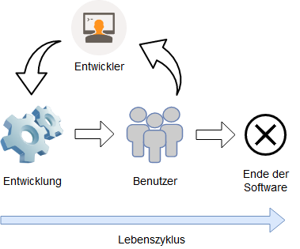
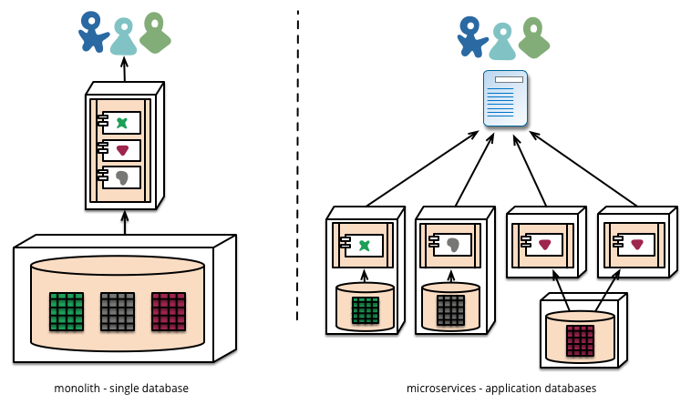
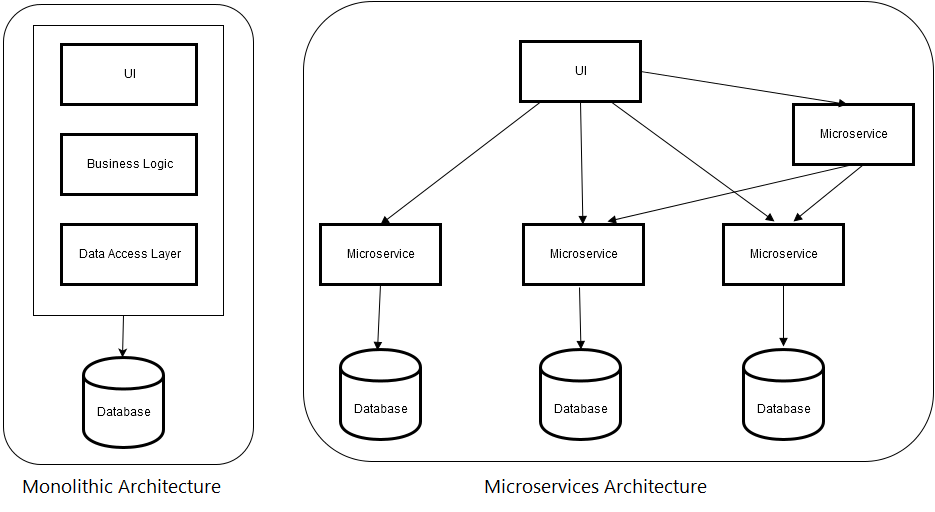

# Microservices

>Ein Microservice ist ein leichtgewichtiger autonomer Dienst, der eine einzige Aufgabe erfüllt und mit anderen ähnlichen Diensten über eine gut definierte Schnittstelle kollaboriert. <a>[[NAMI14]](#ref_Nami14)</a>

## Charakteristiken einer Microservice-Architektur

Es gibt keine formale Definition dieses Architekturstils. Allerdings gibt es gemeinsame Charakteristiken, welche von vielen Microservices geteilt werden. <a>[[LEWI14]](#ref_Lewi14)</a>

### Komponentisierung via Services

Normalerweise wird unter einem Komponenten der Teil einer Software verstanden, welches unabhängig von Anderen veränderbar ist. Microservices bezeichnen einzelne Services, aber auch Bibliotheken, als Komponenten. Eine Bibliothek ist eine eingebundene Komponente und wird durch Funktionsaufrufe aus dem Speicher aufgerufen. Ein Service hingegen wird durch Remote Calls bzw. Web Requests aufgerufen.
Der Vorteil eines Service gegenüber einer Bibliothek liegt in der Unabhängigkeit des Ersten. Ein einziger Prozess kann aus mehreren Bibliotheken bestehen und wäre eine davon verändert, müsste die gesamte Applikation neu aufgesetzt werden. Eine Aufteilung in Services wirkt dem entgegen, weil meistens nur der jeweilige Service geändert werden muss. Desweiteren bringt eine solche Aufsplittung sauber definierte Komponentenschnittstellen mit sich. Das bedeutet, dass einzelne Softwarekomponenten besser voneinander getrennt sind. <a>[[LEWI14]](#ref_Lewi14)</a>

### Aufbau um Business Capabilities

Microservices sollten rund um die Business Capabilities der Organization aufgebaut werden, ganz nach dem Gesetz von Conway. Das Gesetz von Conway besagt, dass die Struktur eines Systems die Kommunikationsstruktur der umsetzenden Organisation nachbildet. Es wird ein breites Feld von Software abgedeckt, wie GUI, Datenbanken, Schnittstellen. Das wiederum bedeutet, dass es cross-functional Teams sein müssen, um all die Bedingungen zu erfüllen. <a>[[LEWI14]](#ref_Lewi14)</a>

Die nächste Abbildung stellt dar, wie Microservices sich den Business Capabilities einer organisation anpassen.

_Microservices und Business Capabilities_, Abbildung entnommen aus <a>[[LEWI14]](#ref_Lewi14)</a>

### Service als Produkt

Software sollte nicht als ein Projekt, sonder vielmals als ein Produkt gesehen werden. Das bedeutet, dass ein Entwicklungsteam während des gesamten Lebenszyklus sich darum kümmert. Auf diese Weise hat diese Team den Feedback, wie sich die Software in realen Arbeitsbedingungen verhält und hat einen engeren Kontakt zu den Benutzern. Das kreiert eine engere Bindung an das eigene Produkt. <a>[[LEWI14]](#ref_Lewi14)</a>

_Betreuung während des Lebenslaufs_, eigene Abbildung

### Smart endpoints and dumb pipes

Die Applikationen der Microservices sollten abgekoppelt und zusammenhängend wie möglich sein. Im Sinne von empfangen einer Anfrage, deren Bearbeitung und senden einer Antwort. Die Protokolle hingegen sollten hingegen unkompliziert sein. Einer der meistgenutzten Protokolle ist HTTP. Das erlaubt die Infrastruktur des Webs zu nutzen, um Ressourcen zu sparen.
Eine andere populäre Möglichkeit ist es lightweight message bus zu nutzen, wo die Infrastruktur nur als Router von Nachrichten fungiert (dumb pipes). <a>[[LEWI14]](#ref_Lewi14)</a>

### Dezentralisierte Führung

Dezentralisierte Führung ist ein Konzept welches aus mehreren Ansätzen besteht. Eines davon erlaubt den einzelnen Entwicklerteams ihre Stärken in verschiedenen Technologien anzuwenden und zusammen ein leistungsfähiges Produkt zu entwickeln, anstatt ihnen einen technologischen Standard aufzuzwingen. Das heißt, dass unter anderem jeder einzelner Service in der dafür am besten passenden Programmiersprache geschrieben werden kann, aber nicht unbedingt muss. Die Entscheidung liegt auf der Ebene der Entwickler, was nicht bedeutet, dass es überhaupt keine Richtlinien gibt.
Einen weiterer Ansatz der dezentralisierten Führung bringt die Amazon Herangehensweise zur Geltung: "You build it, you run it!". Damit ist gemeint, dass ein Entwicklungsteam nicht nur die eigentliche Entwicklung übernimmt, sondern auch die Installation, die Überwachung und die Steuerung dieses Produktes im Einsatz. Das geht weg von dem üblichen Konzept "Entwickeln und vergessen", wo nach der Entwicklung andere Gruppen sich darum kümmern. <a>[[LEWI14]](#ref_Lewi14)</a>, <a>[[PECK17]](#ref_Peck17)</a>

### Dezentralisiertes Datenmanagement

Die Dezentralisierung bei Microservices betrifft auch die Datenbanken. Es wird bevorzugt pro Service eine Datenbank zu haben, seien es nur unterschiedliche Datenbank-Instanzen oder komplett unterschiedliche Datenbanktechnologien. <a>[[LEWI14]](#ref_Lewi14)</a>

Die nächste Abbildung vergleicht ein monolithisches System mit Webservices in Bezug auf die Datenbanken.

_Dezentralisierte Datenbanken_, Abbildung entnommen aus <a>[[LEWI14]](#ref_Lewi14)</a>

### Infrastructure Automation

Testautomatisierung und Ansätze wie Continuous Integration und Continuous Delivery helfen bei der Entwicklung von stabiler und hochwertiger Software. <a>[[LEWI14]](#ref_Lewi14)</a>

### Design for failure

Ein Service ist nicht gegen Ausfälle und Fehler geschützt, deshalb sollte er immer gegen mögliche Fehlerfälle ausgiebig getestet werden. Da allerdings nicht alle möglichen Probleme abgedeckt und vorhergesehen werden können, kommt Monitoring zum Einsatz. Relevanten Metriken und weitere wichtige Information über den Softwarestatus erlauben es rechtzeitig Fehler zu beheben. <a>[[LEWI14]](#ref_Lewi14)</a>

### Evolutionäres Design

Eine Software sollte so designt werden, dass statt es bei größeren Änderungen zu verwerfen, sie weiterentwickelt werden kann. Die wichtigsten Eigenschaften eines Komponenten sind Austauschbarkeit und Erweiterungsfähigkeit - wie kann eine Komponente überarbeitet werden, ohne dass andere Komponenten davon betroffen sind. Oftmals wird ein Service verworfen anstatt auf lange Sicht überarbeitet zu werden. Manchmal macht es Sinn mehrere Dienste zu gruppieren, falls diese immer wieder Abhängigkeiten während Änderungen zeigen. 

Abbildung _Architektur_ zeigt einen möglichen Aufbau von Microservices. Jedem Dienst entspricht eine Funktionalität. Einige Dienste haben eigene Datenbanken, andere greifen auf eine gemeinsame Datenbank zu.

_Microservice Aufbau, Abbildung aus <a>[[MIRI17]](#ref_Miri17)</a>

Vorraussetzungen für Microservices sind:
1. Request/Response calls mit willkürlich strukturierten Daten
2. Asynchrone Events in Echtzeit
3. Bidirektionale Requests und Responses
4. Requests und Responses können willkürlich geschachtelt sein
5. Nachrichtenformat: wie JSON, XML

Wenn es um Microservices geht müssen die Remote Calls näher betrachtet werden.

### Kommunikation mit Microservice

Einige häufig anzutreffende Entwürfen von Remote Calls sind Direct Call, Gateway und Message Bus.

__Direct Call__

_Direct Call_, Abbildung angepasst aus <a>[[NAMI14]](#ref_Nami14)</a>

__Gateway__

_Gateway_, Abbildung angepasst aus <a>[[NAMI14]](#ref_Nami14)</a>

__Message-bus__

_Message Bus_, Abbildung angepasst aus <a>[[NAMI14]](#ref_Nami14)</a>

Eine der Hauptaufgaben von Microservices ist eine Minimierung von Einflüssen im Falle einer möglichen Schnittstellenänderung. <a>[[NAMI14]](#ref_Nami14)</a>

## Unterschiede zu monolithischen Anwendungen

Monolithischen Anwendungen werden als ein Ganzes entwickelt. Sie bestehen oft aus drei Schichten:
- Clientseitige Applikation
- Serverseitige Applikation
- Datenbank

Eine serverseitige Applikation ist ein solches Monolith, weil sie für HTTP-Anfragen zuständig ist, Zugriffe auf die Datenbank steuert und mit dem Browser interagiert. Eine Änderung im System führt zu einer neuen Version der ganzen Software. Die ganze Logik konzentriert sich in einer ausführbaren Datei. Es ist ein natürlich Weg zu entwickeln. Optimierung kan mithilfe eines Load Balancer erfolgen, damit mehrere Instanzen der Applikation nebenbei laufen können.
Allerdings kann schwierig werden eine solche Anwendung auf Dauer zu entwickeln. Es erfordert viel Aufwand ständige Änderungen und Korrekturen zu implementieren, denn bei einem Monolith muss jedes Mal das ganze System neu erstellt werden. Desweiteren ist es aufwändig die Modularität der Software aufrecht zu erhalten, ohne das intern ungewollte Abhängigkeiten zwischen den Modulen entstehen. Auch eine Skalierung des ganzen Systems erfordert viel mehr Ressourcen, als eines einzelnen Moduls. <a>[[LEWI14]](#ref_Lewi14)</a>

Eine schematischer Aufteilung einer monolithischen Anwendung in Microservices kann in der nächsten Abbildung betrachtet werden.

_Microservices vs Monolith_, Eigene Darstellung

Jedes einzelnes Microservice kann in komplett anderer Programmiersprache geschrieben sein. Im Gegensatz dazu kann eine monolithische Architektur zwar mehrere Dienste oder Komponenten enthalten - sie bilden aber trotzdem ein Ganzes.<a>[[NAMI14]](#ref_Nami14)</a>

### Vorteile

- übersichtlicher Code, weil je Dienst, deswegen einfacher neuer Entwickler reinzubringen
- Modifizierbarkeit, muss nicht die gesamte Architektur verändert werden
- Macht kontinuierliche Entwicklung einfacher
<a>[[LEWI14]](#ref_Lewi14)</a>

- Erhöhte Einsatzfähigkeit
- Unabhängigkeit in der Entwicklung pro Dienst
- Kürzere Entwicklungszeiten
- Resistenz
- Erleichterte Umsetzung innovativer Lösungen
<a>[[NAMI14]](#ref_Nami14)</a>

- Besser testbarkeit - kleine Services sind einfacher zu testen
- bessere Einsatzfähigkeit - Services sind unabhängiger
- "Zwei Pizzen" Teams - mehrere autonome Gruppen pro Service
- Service ist relativ klein gehalten wegen Einfachheit, schnellerer Entwicklung und größerer Produktivität
- Bessere Fehlereingrenzung
- Unabhängigkeit und Stabilität - andere Services arbeiten weiter
-  Technologie-unabhängig, Vorteile von neuen Technologien und Sprachen, hohe Modifizierbarkeit
<a>[[RICH17]](#ref_Rich17)</a>

http://microservices.io/patterns/microservices.html

### Nachteile

- Viele Remote Calls
- Bis zu einer bestimmten Größe, schwieriger zu entwickeln, da Partitionierung
- Schwerer aufzusetzen als eine monolithische Struktur (größter Nachteil)
- Mehrere Kopien gleichzeitig laufen zu lassen nicht möglich, Load Balancer
- Zusätzliche Komplexität, weil ein System in unterschiedliche Dienste partitioniert werden soll
- Größerer Speicherbedarf, weil jeder Dienst eigenen Platz beansprucht
- Testen ist komplizierter, da die Dienste verteilt sind
<a>[[NAMI14]](#ref_Nami14)</a>

- Remote Calls verbrauchen mehr Ressourcen als In-Prozess Calls
- Prozessgrenzen machen Verteilung der Kompetenzen schwieriger
<a>[[LEWI14]](#ref_Lewi14)</a>

- mehr Komplexität
- 
<a>[[RICH17]](#ref_Rich17)</a>

http://microservices.io/patterns/microservices.html

## Humane Registries

https://martinfowler.com/bliki/HumaneRegistry.html
https://de.wikipedia.org/wiki/Humane_Registry

## Microservices Varianten

### Developer Anarchy

https://itnext.io/what-is-developer-anarchy-and-how-is-it-different-from-agile-software-development-6e212d6b8dfb
https://martinjeeblog.com/2012/11/20/what-is-programmer-anarchy-and-does-it-have-a-future/

### REST in Microservices

https://capgemini.github.io/architecture/is-rest-best-microservices/
https://dzone.com/articles/5-best-practices-for-rest-based-microservices

### Self-contained Systems

?

https://www.elastic.io/breaking-down-monolith-microservices-and-self-contained-systems/

## Serverless

Eine Architektur, welche auf Drittanbieter angewiesen ist.

- Cloud Function, Function as a service, Drittanbieter für Server, Datenbank auf dem Server, günstig, einfacher aufzusetzen

https://martinfowler.com/articles/serverless.html
https://thepowerofserverless.info/

## Microservice as frontends

https://medium.com/@tomsoderlund/micro-frontends-a-microservice-approach-to-front-end-web-development-f325ebdadc16

## Quellen

<a name="ref_Chen18">[CHEN18]</a>: Chen, Lianping: Microservices: Architecting for Continuous Delivery and DevOps, IEEE International Conference on Software Architecture, 2018, URL: https://www.researchgate.net/publication/323944215_Microservices_Architecting_for_Continuous_Delivery_and_DevOps

<a name="ref_Miri17">[MIRI17]</a>: Miri, Ima: Microservices vs. SOA, 04.01.2017, URL: https://dzone.com/articles/microservices-vs-soa-2

<a name="ref_Lewi14">[LEWI14]</a>: Lewis James; Fowler, Martin: Microservices, a definition of this new architectural term, 25.03.2014, URL: https://martinfowler.com/articles/microservices.html (letzter Zugriff: 24.05.2018)

<a name="ref_Nami14">[NAMI14]</a>: Namiot, Dmitry; Sneps-Sneppe, Manfred: On Micro-services Architecture, International Journal of Open Information Technologies ISSN: 2307-8162 vol. 2, no. 9, 2014,
URL: https://cyberleninka.ru/article/v/on-micro-services-architecture (letzter Zugriff: 26.04.2018)

<a name="ref_Peck17">[PECK17]</a>: Peck, Nathan: Microservice Principles: Decentralized Governance, 05.09.2017, URL: https://medium.com/@nathankpeck/microservice-principles-decentralized-governance-4cdbde2ff6ca

<a name="ref_Rich17">[RICH17]</a>: Richardson, Chris: Pattern: Microservice Architecture, 2017, URL: http://microservices.io/patterns/microservices.html (letzter Zugriff: 26.04.2018)